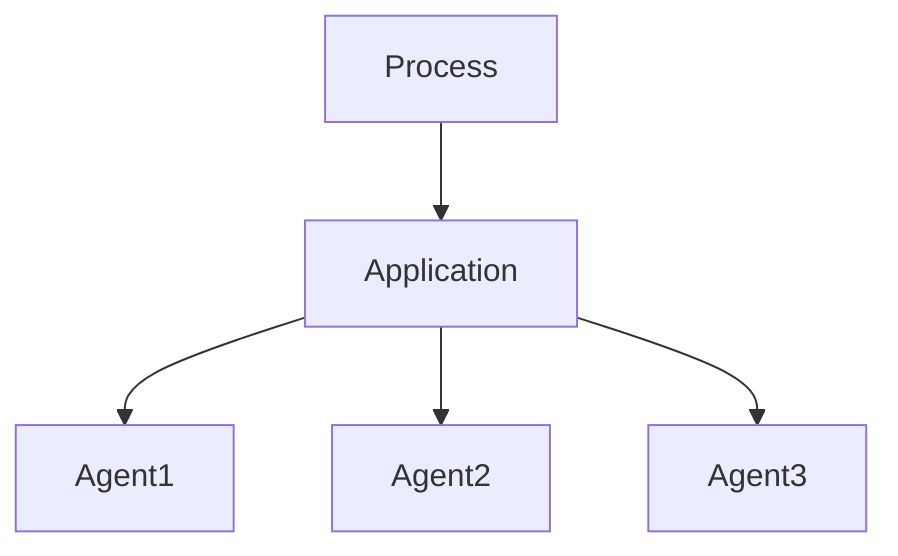
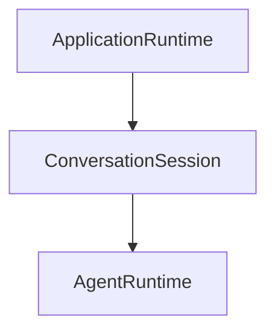
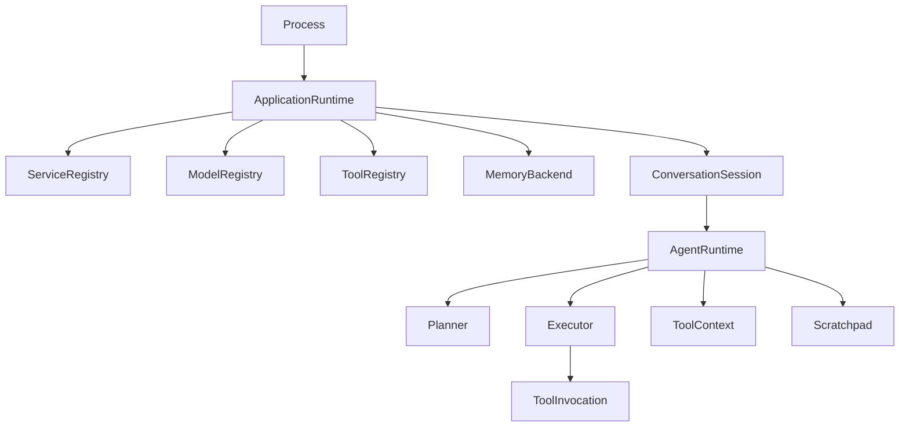

You're asking about the **runtime aggregation lattice** for an agent system. The key design question is whether **ApplicationSession** and **AgentRuntime** represent distinct semantic aggregates or whether one is just a wrapper around the other.

The answer depends on the scope of their state.

## Step 1 — Define the semantic domains

There are three distinct kinds of runtime that are often conflated:

$$
\text{ProcessRuntime}
\supset
\text{ApplicationRuntime}
\supset
\text{AgentRuntime}
$$

Each owns a different state space.

### Process Runtime

The OS process.

State:

$$
S_P =
Memory
\times
Threads
\times
Sockets
\times
Filesystem
\times
Signals
$$

This is usually not modeled directly in your application.

---

### Application Runtime

Owns everything that exists for the lifetime of your application.

Examples

* configuration
* dependency injection
* logger
* telemetry
* database pool
* model registry
* tool registry
* scheduler
* cache
* plugin system

Formally

$$
S_A
===

Config
\times
Services
\times
Resources
\times
GlobalState
$$

This is essentially your composition root.

---

### Agent Runtime

Owns exactly one executing agent.

State

$$
S_G
===

Conversation
\times
Memory
\times
PlanningState
\times
ToolContext
\times
Scratchpad
\times
ExecutionGraph
$$

Notice these are *per-agent*.

---

## Step 2 — Are they redundant?

Suppose your application only ever runs **one** agent.

Then

$$
S_A \cong S_G
$$

and separating them buys almost nothing.

This is why many tutorials have

```
App
 └── Agent
```

and stop there.

---

Suppose instead you run

* ten conversations
* background workers
* evaluation agents
* orchestration agents

Now

$$
S_A
===

Infrastructure
\times
Agent_1
\times
Agent_2
\times
\cdots
\times
Agent_n
$$

The distinction becomes essential.

---

## Step 3 — Ownership lattice

A clean ownership hierarchy is



Application owns shared infrastructure.

Each agent owns execution state.

---

## Step 4 — Session is orthogonal

People often write

```
Application
    ↓
Session
    ↓
Agent
```

But "session" is overloaded.

There are at least three meanings.

### User session

Authentication.

```
User

↓

Identity

↓

Permissions
```

---

### Conversation session

Chat history.

```
Conversation

↓

Messages

↓

Context
```

---

### Runtime session

Temporary execution.

```
Execution

↓

Scratchpad

↓

Current Plan
```

These should usually not be the same object.

---

## Step 5 — A better decomposition

Instead of

```
ApplicationSession

↓

AgentRuntime
```

consider



where

### ApplicationRuntime

Owns

* configuration
* model clients
* caches
* database
* telemetry
* tool registry
* prompt registry

---

### ConversationSession

Owns

* conversation id
* user id
* message history
* persistent memory references
* attachments
* checkpoints

---

### AgentRuntime

Owns only live execution

* planner
* current reasoning graph
* tool execution
* temporary variables
* recursion stack
* streaming state
* cancellation token

Notice

ConversationSession survives after execution.

AgentRuntime disappears.

---

## Step 6 — Lifetime lattice

This is often the most useful way to decide boundaries.

```text
Process
│
├────────────── lives for process
│
ApplicationRuntime
│
├────────────── lives until shutdown
│
ConversationSession
│
├────────────── lives hours or days
│
AgentRuntime
│
├────────────── lives seconds or minutes
│
ToolInvocation
│
└────────────── lives milliseconds
```

The partial order is by **lifetime**:

$$
ToolInvocation
<
AgentRuntime
<
ConversationSession
<
ApplicationRuntime
<
Process
$$

A longer-lived aggregate may own shorter-lived ones, but not the reverse.

---

## Step 7 — Recommended harness architecture

For a production agent harness, I would use:



This decomposition avoids redundant wrappers while respecting ownership and lifetime. In category-theoretic terms, each aggregate is a product of orthogonal state spaces, and the ownership relation forms a refinement partial order: every child's state is meaningful only relative to its parent, but the parent can exist independently of any particular child. That makes `ApplicationRuntime` and `AgentRuntime` complementary rather than redundant whenever your system supports multiple conversations or concurrent agents.
