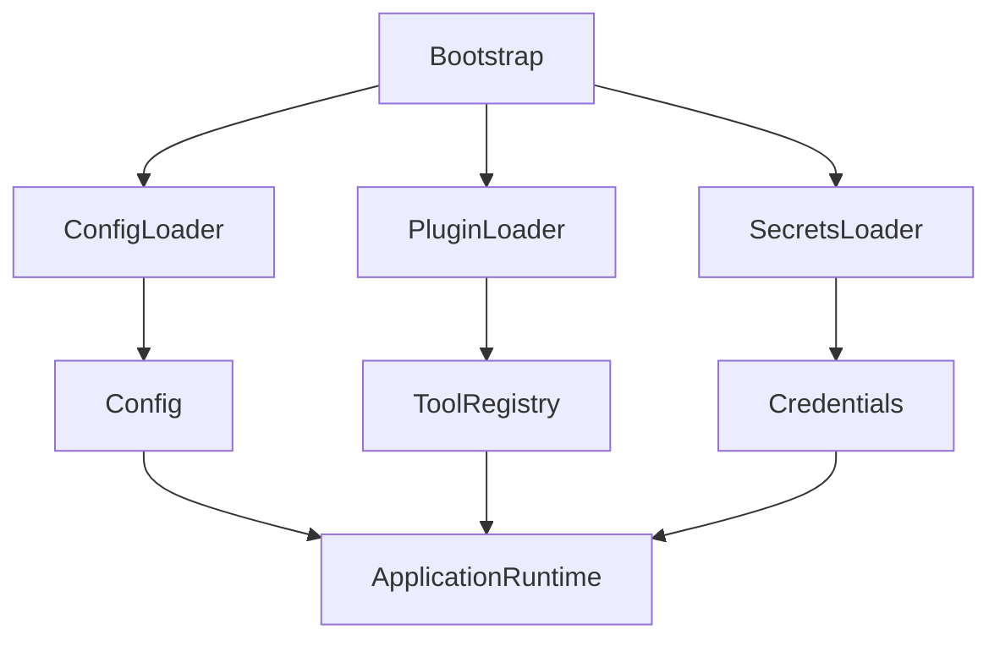
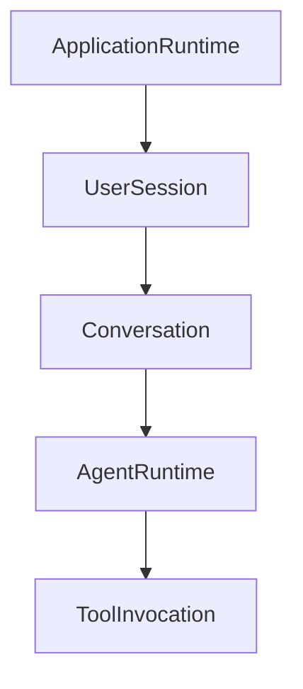

I think there are three separate concerns here that are worth separating because they have different algebraic roles:

1. **Construction** (bootstrap)
2. **Ownership** (application runtime)
3. **Execution** (agent runtime)

Most frameworks accidentally mix all three together.

---

# 1. Bootstrap should not be a runtime

Bootstrap is a **constructor**, not part of the long-lived object graph.

Formally, if

$$
A = \text{ApplicationRuntime}
$$

then bootstrap is simply

$$
\beta : () \rightarrow A
$$

or more realistically

$$
\beta :
ConfigSource
\times
Environment
\rightarrow
Result<ApplicationRuntime>
$$

It exists only to construct the application.

After construction,

$$
\beta
$$

disappears.

Think of it as an initial algebra.

---

# 2. ApplicationRuntime owns configuration

I would avoid

```rust
struct Bootstrap {
    config: Config,
}
```

because Bootstrap is transient.

Instead

```rust
Bootstrap
    ↓ loads
Config
    ↓ constructs
ApplicationRuntime
```

```rust
pub struct ApplicationRuntime {
    config: Config,
    services: ServiceRegistry,
    tools: ToolRegistry,
    models: ModelRegistry,
    memory: MemoryBackend,
}
```

The runtime owns everything required for execution.

---

# 3. Lifetime hierarchy

A nice ownership lattice is

```text
Process
    │
Bootstrap
    │
ApplicationRuntime
    │
UserSession
    │
AgentRuntime
    │
ToolInvocation
```

Notice Bootstrap is **not** underneath ApplicationRuntime.

It exists *before* it.

---

# 4. ApplicationRuntime should be immutable

One Rust idiom is

```rust
pub struct ApplicationRuntime {
    config: Config,
    models: Arc<ModelRegistry>,
    tools: Arc<ToolRegistry>,
    memory: Arc<MemoryBackend>,
}
```

ApplicationRuntime is almost entirely immutable after construction.

Only the services themselves may contain synchronization primitives.

---

# 5. UserSession

I actually like your idea.

Rather than "conversation session"

make it

```rust
pub struct UserSession {
    id: UserSessionId,

    identity: Identity,

    conversations: ConversationStore,

    preferences: Preferences,
}
```

Notice this is authentication and persistence.

It survives multiple conversations.

---

Then

```rust
pub struct Conversation {
    id: ConversationId,

    history: MessageHistory,

    attachments: Vec<Attachment>,

    memories: Vec<MemoryReference>,
}
```

---

Then

```rust
pub struct AgentRuntime {
    planner: Planner,

    executor: Executor,

    scratchpad: Scratchpad,

    tool_context: ToolContext,

    execution_graph: ExecutionGraph,
}
```

Notice these are completely different state spaces.

---

# 6. Construction graph

Construction should flow downward exactly once.



Once ApplicationRuntime exists,

Bootstrap disappears forever.

---

# 7. Runtime graph

Then execution becomes



This graph changes dynamically.

Bootstrap never appears again.

---

# 8. Traits vs concrete structs

I would keep the runtime concrete.

```rust
pub struct ApplicationRuntime { ... }
```

rather than

```rust
trait Runtime {}
```

because there is almost never another runtime implementation.

Instead abstract the services.

```rust
trait ModelProvider {}

trait MemoryStore {}

trait ToolExecutor {}

trait EventBus {}
```

Then

```rust
pub struct ApplicationRuntime {
    models: Arc<dyn ModelProvider>,
    memory: Arc<dyn MemoryStore>,
    tools: Arc<dyn ToolExecutor>,
}
```

The runtime itself is just composition.

---

# 9. Ownership specification

I'd model the ownership as

$$
ApplicationRuntime
==================

Config
\times
Services
\times
Registries
\times
Infrastructure
$$

$$
UserSession
===========

Identity
\times
Preferences
\times
ConversationStore
$$

$$
Conversation
============

History
\times
Attachments
\times
MemoryReferences
$$

$$
AgentRuntime
============

Planner
\times
Executor
\times
Scratchpad
\times
ExecutionState
$$

Each aggregate introduces a new, mostly orthogonal coordinate of state.

---

## One refinement I'd suggest

I would separate **construction** from **ownership** even more explicitly by introducing an `ApplicationBuilder`. This aligns well with Rust's ownership model and avoids giving "Bootstrap" ongoing semantic weight.

```rust
pub struct ApplicationBuilder {
    config_loader: ConfigLoader,
    plugin_loader: PluginLoader,
    secrets_loader: SecretsLoader,
}

impl ApplicationBuilder {
    pub fn build(self) -> Result<ApplicationRuntime> {
        // load config
        // initialize registries
        // wire dependencies
        // return ApplicationRuntime
    }
}
```

Then the lifecycle is:

```text
main
  ↓
ApplicationBuilder
  ↓
ApplicationRuntime
  ↓
UserSession
  ↓
Conversation
  ↓
AgentRuntime
  ↓
ToolInvocation
```

From a category-theoretic perspective, `ApplicationBuilder` is a morphism that constructs the object `ApplicationRuntime`; it is not itself an object in the runtime category. Once `ApplicationRuntime` exists, all subsequent behavior is expressed as morphisms between runtime states (creating sessions, starting agents, invoking tools), while the builder has no further role. This separation keeps construction, ownership, and execution as distinct layers with clear lifetimes and responsibilities.
