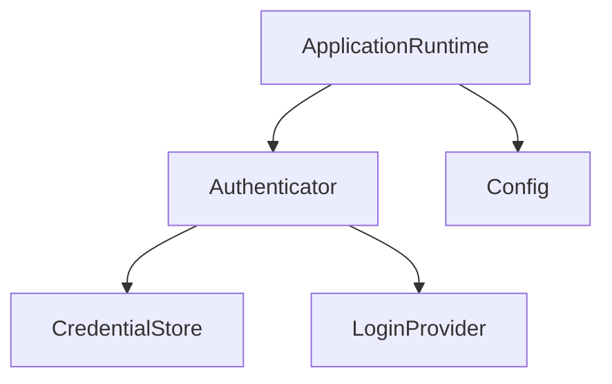

You're asking exactly the right question. The deeper issue is not `&self` versus no `&self`; it's **what algebraic object `Authenticator` is**.

There are three reasonable designs.

---

# Option 1 — Authenticator is a stateful service (most common)

```rust
struct Authenticator {
    credential_store: CredentialStore,
    login_provider: LoginProvider,
}

impl Authenticator {
    async fn authenticate(
        &self,
    ) -> Result<UserIdentity> {
        ...
    }
}
```

Why `&self`?

Because the authenticator **owns dependencies**, even if it doesn't own domain state.

Its state is

$$
Authenticator
=

CredentialStore
\times
LoginProvider.
$$

It isn't mutating itself, so `&self` is sufficient.

This is the pattern you'll see throughout idiomatic Rust.

---

# Option 2 — Pure function (also perfectly valid)

Suppose you really want

$$
authenticate :
Dependencies
\times
Credentials
\rightarrow
Identity.
$$

Then:

```rust
async fn authenticate(
    config: &Config,
    login: &LoginProvider,
) -> Result<UserIdentity>
```

or

```rust
async fn authenticate(
    deps: &AuthDependencies,
)
```

Now there is no `Authenticator` object.

This is completely legitimate.

---

# Option 3 — Functional object (my favorite)

Instead of the authenticator owning concrete resources, make it a coordinator over abstractions.

```rust
struct Authenticator<S, P> {
    store: S,
    provider: P,
}
```

where

```rust
trait CredentialStore

trait LoginProvider
```

Then

```rust
impl<S,P> Authenticator<S,P> {
    async fn authenticate(
        &self
    )
}
```

The authenticator itself is almost pure; it just composes two capabilities.

---

# Where should cached credentials come from?

This is where I would avoid coupling authentication to configuration.

I would distinguish:

Configuration:

```text
config.toml
```

contains

```text
theme

api endpoint

default model

window size
```

Credentials:

```text
~/.myapp/token.json
```

contains

```text
refresh token

access token

expiry
```

Those are different domains.

---

So instead of

```rust
config.load_cached()
```

I'd prefer

```rust
credential_store.load()
```

because algebraically

Configuration

$$
Config
$$

and

Credential storage

$$
CredentialStore
$$

are different objects.

---

# Why?

Suppose later you store credentials in

* macOS Keychain
* Windows Credential Manager
* Linux Secret Service
* encrypted SQLite
* cloud vault

Nothing about your configuration changes.

So

```text
Config
```

and

```text
CredentialStore
```

have different reasons to change.

---

# Is ConfigManager over-engineering?

Usually, yes.

I probably wouldn't have

```text
ConfigManager

CredentialManager

PreferenceManager

ThemeManager
```

at the beginning.

Instead:

```rust
struct Config
```

with free functions:

```rust
impl Config {
    fn load(...)
}
```

or

```rust
Config::from_file(...)
```

Likewise:

```rust
struct FileCredentialStore
```

implements

```rust
trait CredentialStore
```

No "manager."

---

# Clean boundaries

One of my favorite tests is to ask:

> **Could I replace this subsystem without changing the others?**

Configuration?

Yes.

Credential storage?

Yes.

Authentication provider?

Yes.

Therefore they deserve separate boundaries.

---

Your dependency graph becomes



Notice

Authenticator

never depends on Config.

Config is merely used during application construction.

---

# The construction phase

Bootstrap:

```rust
let config = Config::load();

let store =
    FileCredentialStore::new(
        config.credentials_path,
    );

let provider =
    OAuthProvider::new(
        config.client_id,
    );

let authenticator =
    Authenticator::new(
        store,
        provider,
    );
```

After construction,

```text
Config
```

is almost forgotten.

The authenticator only knows

```text
CredentialStore

LoginProvider
```

This is dependency injection.

---

# Category-theoretically

I would separate three categories:

### Configuration category

Objects:

$$
Config
$$

Morphisms:

$$
load :
File
\rightarrow
Config.
$$

---

### Authentication category

Objects:

$$
Credentials,
Identity.
$$

Morphisms:

$$
authenticate :
Credentials
\rightarrow
Identity.
$$

---

### Persistence category

Objects:

$$
CredentialStore.
$$

Morphisms:

$$
save,
load.
$$

The bootstrap phase composes these categories by wiring objects together, but after construction each subsystem only depends on the interfaces it actually needs.

---

## My recommendation for your harness

Given your goal of learning architecture rather than minimizing lines of code, I'd start with:

```text
Config                    // immutable data
CredentialStore (trait)   // persistence boundary
LoginProvider (trait)     // external auth boundary
Authenticator             // orchestration
SessionManager
```

where:

* `Config` is **data**, not a service.
* `Authenticator` has `&self` because it owns references to the injected capabilities, not because it owns mutable authentication state.
* `CredentialStore` is responsible for `load()` and `save()`.
* `Config` is only consulted during bootstrap to construct those objects.

That keeps the boundaries aligned with responsibilities instead of file formats or implementation details, and it scales naturally if you later swap storage backends or authentication providers.
