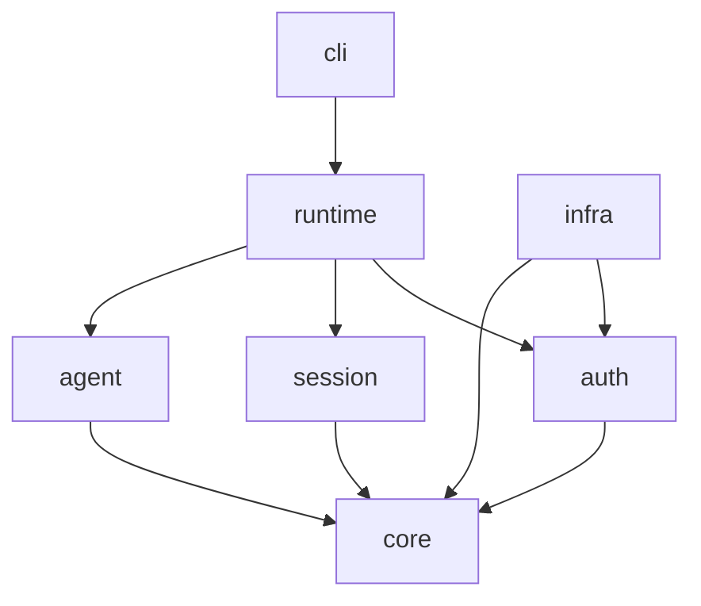

Your current structure is actually at the point where **a workspace split starts making sense**, but I would not immediately split every folder into a crate. First identify **dependency boundaries**.

Right now everything is under one binary crate:

```text
mini-codex
└── app
    └── src
```

You want:

```text
mini-codex
├── crates/
│   ├── core/
│   ├── auth/
│   ├── session/
│   ├── agent/
│   ├── runtime/
│   ├── infra/
│   └── cli/
└── Cargo.toml
```

---

## 1. Create workspace root

From your repo:

```bash
cd ~/projects/mini-codex
```

Move your current `app`:

```bash
mkdir crates
mv app crates/cli
```

Now create root Cargo:

```bash
cargo init --workspace
```

Your root:

```text
mini-codex/
├── Cargo.toml
└── crates/
    └── cli/
```

Root `Cargo.toml`:

```toml
[workspace]
members = [
    "crates/cli",
]
resolver = "2"
```

---

# 2. Create crates

Commands:

```bash
cargo new crates/core --lib
cargo new crates/auth --lib
cargo new crates/session --lib
cargo new crates/agent --lib
cargo new crates/runtime --lib
cargo new crates/infra --lib
```

Now:

```text
crates/
├── agent
├── auth
├── cli
├── core
├── infra
├── runtime
└── session
```

---

# 3. Map your current modules

Your current:

```text
domain/
├── events
├── states
├── conversation
├── config
```

becomes:

## core

Pure domain primitives:

```text
core/
└── src/
    ├── events.rs
    ├── state.rs
    ├── error.rs
    └── config.rs
```

Contains:

```rust
pub enum Event {}

pub trait EventSink {}

pub type Result<T> = ...
```

No database.
No OAuth.
No HTTP.

---

## auth crate

Move:

```text
auth.rs
states/auth
```

into:

```text
auth/
└── src/
    ├── lib.rs
    ├── authenticator.rs
    ├── state.rs
    └── provider.rs
```

Depends:

```toml
[dependencies]
core = { path="../core" }
```

---

## session crate

Move:

```text
user_session/
states/session
```

into:

```text
session/
└── src/
    ├── lib.rs
    ├── state.rs
    ├── controller.rs
    └── builder.rs
```

Depends:

```toml
core
auth
```

---

## agent crate

Move:

```text
agent_runtime.rs
states/agent_runtime
conversation
```

into:

```text
agent/
└── src/
    ├── lib.rs
    ├── runtime.rs
    ├── conversation.rs
    ├── state.rs
    └── controller.rs
```

Depends:

```toml
core
```

---

## runtime crate

This is your orchestration layer.

Move:

```text
app_runtime.rs
app_builder.rs
states/app_runtime
```

into:

```text
runtime/
└── src/
    ├── lib.rs
    ├── builder.rs
    ├── runtime.rs
    └── state.rs
```

Depends:

```toml
core
auth
session
agent
```

---

## infra crate

Later:

```text
infra/
├── postgres.rs
├── auth0.rs
├── filesystem.rs
```

Implements traits.

Depends:

```toml
auth
core
```

---

# 4. Add dependencies

Example:

```bash
cargo add core --path crates/core -p runtime
```

or manually:

```toml
[dependencies]
core = { path="../core" }
auth = { path="../auth" }
session = { path="../session" }
agent = { path="../agent" }
```

---

# 5. Final dependency DAG

You want:



No arrows upward.

Meaning:

`agent` should never import `runtime`.

`session` should never import `cli`.

---

# 6. Your first refactor order

Do not move randomly. Do:

### Step 1

Create:

```text
core
```

Move:

* events
* errors
* shared types

---

### Step 2

Extract:

```text
auth
```

Make login compile independently.

---

### Step 3

Extract:

```text
session
```

---

### Step 4

Extract:

```text
agent
```

---

### Step 5

Extract:

```text
runtime
```

---

### Step 6

CLI becomes tiny:

```rust
#[tokio::main]
async fn main() {

    let runtime =
        Bootstrap::build()
            .await
            .unwrap();

    runtime.run().await;
}
```

---

One thing I would change from your current tree: **do not have `user_session_runtime.rs` and `user_session/builder.rs` at the same level.** Decide:

* `UserSession` = domain state
* `SessionBuilder` = construction
* `SessionController` = transitions

Keep those together in the `session` crate. The application runtime should only orchestrate it.
