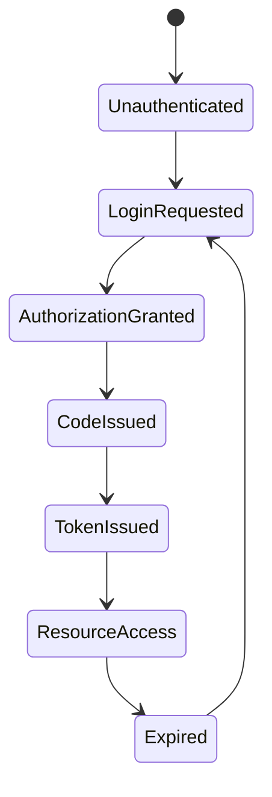

Your question spans several levels of abstraction. We can decompose it into:

1. **Protocol semantics** (what problem OAuth and PKCE solve)
2. **State machine** (protocol execution)
3. **Algebraic structure** (objects, morphisms, invariants)
4. **Production architecture** (where the code lives)
5. **Verification** (how to know it is correct)

The important point is that **PKCE is not an alternative to OAuth**.

Instead,

$$
\text{OAuth 2.0}
\supset
\text{Authorization Code Flow}
\supset
\text{PKCE Extension}
$$

PKCE is simply an extra invariant added to one OAuth flow.

---

# 1. OAuth algebraically

OAuth is fundamentally an **authorization delegation protocol**.

Instead of

```
Client
    |
    | username/password
    |
Resource Owner
```

we create a morphism

$$
\text{User}
\longrightarrow
\text{Authorization Server}
\longrightarrow
\text{Client}
$$

The client never receives credentials.

Instead it receives a capability

$$
\text{Access Token}
$$

which is simply

$$
Capability(Resource, Scope, Expiration)
$$

Think of a token as an element

$$
t\in T
$$

where

$$
verify:T\rightarrow Permissions
$$

---

# 2. OAuth state machine

States



Notice there are two state machines.

Client

```
Waiting

↓

Redirect

↓

Receive code

↓

Exchange code

↓

Authenticated
```

Authorization server

```
Receive login

↓

Authenticate user

↓

Issue authorization code

↓

Verify code

↓

Issue token
```

These synchronize over messages.

---

# 3. Authorization Code flow

Without PKCE

Client

↓

redirect

↓

authorization code

↓

POST

```
authorization_code
client_secret
```

↓

access token

This assumes

> whoever owns the client_secret is the legitimate application.

Works well for

* backend
* confidential clients

---

# 4. Why PKCE exists

Mobile apps

Desktop apps

SPAs

cannot safely hide a client secret.

Someone can decompile the app.

So OAuth loses one invariant.

Old invariant

$$
OnlyClientKnowsSecret
$$

becomes false.

Need another invariant.

PKCE introduces

```
code_verifier
```

Random

256 bits

Example

```
abc93...
```

Client computes

```
code_challenge

=

SHA256(code_verifier)
```

and sends only

```
code_challenge
```

during login.

Later

when exchanging code

it reveals

```
code_verifier
```

Server computes

```
SHA256(verifier)
```

and checks

```
== challenge
```

Therefore

only whoever originally created

```
code_verifier
```

can exchange the authorization code.

---

# 5. Algebraically

PKCE adds an invariant.

Without PKCE

Authorization code

$$
c
$$

is sufficient.

Transition

$$
c
\rightarrow
token
$$

With PKCE

Need pair

$$
(c,v)
$$

where

$$
Hash(v)=challenge(c)
$$

Transition becomes

$$
(c,v)
\rightarrow
token
$$

only if

$$
Hash(v)=storedChallenge
$$

So transition relation becomes

$$
Next
\subseteq
(Code\times Verifier)
\times
Token
$$

instead of

$$
Code
\times
Token
$$

PKCE simply strengthens the transition predicate.

---

# 6. Category-theoretic view

Objects

$$
User
$$

$$
Client
$$

$$
AuthorizationServer
$$

$$
ResourceServer
$$

Morphisms

```
login

↓

authorization

↓

code

↓

token

↓

resource
```

Composition

$$
f_4\circ f_3\circ f_2\circ f_1
$$

must preserve authentication.

PKCE inserts another morphism

$$
Verifier
\rightarrow
Challenge
$$

and later verifies the inverse property

```
Verifier

↓

Hash

↓

Challenge
```

commutes with

stored challenge.

The protocol accepts only if the square commutes.

---

# 7. Algebraic data model

A production model might be

```rust
AuthorizationRequest

AuthorizationCode

CodeChallenge

CodeVerifier

AccessToken

RefreshToken
```

Transitions

```
AuthorizationRequest
    ↓

AuthorizationCode
    ↓

AccessToken
    ↓

RefreshToken
```

PKCE inserts

```
CodeVerifier
    ↓ hash

CodeChallenge
```

---

# 8. Core invariants

Think like TLA+.

Invariant 1

Authorization code is single use.

$$
Used(code)
\implies
\neg ExchangeAllowed(code)
$$

---

Invariant 2

Code expires.

$$
Now>Expiry
\implies
Reject
$$

---

Invariant 3

Redirect URI matches.

---

Invariant 4

PKCE challenge matches verifier.

---

Invariant 5

Access token signature verifies.

---

Invariant 6

Scopes are monotone

A token never gains permissions.

---

Invariant 7

Refresh token rotation

Old refresh token becomes invalid after use.

---

# 9. Common production architecture

Almost nobody writes OAuth from scratch.

Instead

```
Application

↓

OIDC middleware

↓

OAuth library

↓

Identity Provider
```

Examples include identity providers such as Auth0, Keycloak, Okta, Microsoft Entra ID, Google Identity, and GitHub OAuth Apps.

Your application generally becomes

```
Browser

↓

OAuth library

↓

Identity Provider

↓

Your Backend

↓

Business Logic
```

The application should not implement cryptography or protocol details itself.

---

# 10. Typical design patterns

### Strategy

Different providers

```
Google

GitHub

Microsoft

Apple
```

implement one interface

```text
IdentityProvider
```

---

### Adapter

Every provider returns different JSON.

Convert to one

```
UserIdentity
```

---

### State Machine

Every login request has explicit protocol state.

---

### Capability

Access token represents capability.

---

### Factory

Construct authenticated session only after successful verification.

---

### Repository

Persist

* refresh tokens
* revoked tokens
* login sessions

---

### Middleware

Authentication sits before business logic.

---

# 11. Should you outsource it?

For almost every application, yes.

Use an established identity provider or a mature OAuth/OIDC server rather than implementing the protocol yourself. Your application should focus on authorization policy (roles, permissions, business rules), not protocol correctness.

You still need to understand:

* OAuth flows
* PKCE
* OIDC ID tokens
* JWT validation
* refresh token rotation
* session management
* CSRF protection for browser flows

But you generally should not implement:

* token signing
* authorization code generation
* PKCE internals
* cryptographic primitives
* OIDC protocol logic

---

# 12. How do you verify correctness?

Treat the protocol as a labeled transition system.

Let the protocol state be

$$
S=(Sessions, Codes, Tokens, Users)
$$

with transition relation

$$
Next \subseteq S \times S.
$$

Specify safety invariants such as:

* Authorization codes are consumed at most once.
* Every issued access token corresponds to a previously authorized code.
* A token is never issued unless the PKCE predicate
  $$
  \operatorname{SHA256}(\text{verifier})=\text{stored challenge}
  $$
  holds.
* Redirect URIs exactly match registered values.
* Expired codes and tokens cannot be used.

Then verify these at multiple layers:

* **Formal specification:** Model the protocol state machine in TLA+ or PlusCal and model-check the safety invariants.
* **Property-based testing:** Generate random protocol traces (successful logins, replay attempts, expired codes, incorrect verifiers) and assert the invariants always hold.
* **Conformance testing:** Exercise your implementation against the OAuth 2.0 and OpenID Connect specifications using existing interoperability test suites where available.
* **Penetration testing:** Verify resistance to authorization code interception, replay, CSRF, redirect URI manipulation, and token substitution attacks.

The general engineering principle is to **outsource protocol implementation but verify integration**. Your responsibility is ensuring that the identity provider, OAuth library, and your application's authorization logic compose correctly, while relying on well-tested implementations for the cryptographic and protocol machinery.
