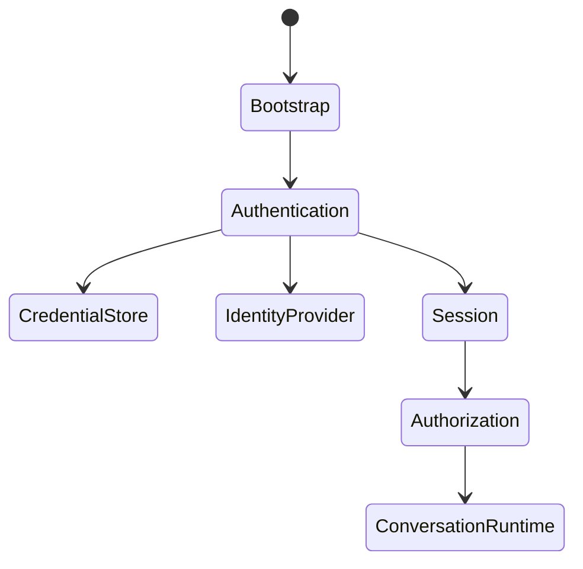

If your goal is to build a **production-quality CLI harness**, I'd separate it into **security domains** (congruence classes in the sense that each class preserves its own invariants and can evolve independently). Each domain corresponds to a distinct aggregate with its own state machine, specifications, and tests.

For a CLI using Auth0 or Okta with OAuth 2.1 + PKCE, I'd organize it like this.

# Top-level decomposition

```text
ApplicationRuntime
├── Bootstrap
├── Authentication
├── Authorization
├── Session
├── Credential Storage
├── Transport Security
├── Request Signing
├── Secret Management
├── Audit
├── Policy
└── Conversation Runtime
```

Notice these are **security concerns**, not implementation classes.

---

# 1. Authentication

Invariant:

[
\boxed{
Identity \iff ProofOfAuthentication
}
]

Responsible for proving who the user is.

Owns:

```rust
enum AuthState {
    Start,
    WaitingForBrowser,
    WaitingForCallback,
    WaitingForToken,
    Authenticated,
    Failed,
}
```

Boundary:

```rust
trait IdentityProvider {
    async fn authorize(...);
    async fn exchange_code(...);
    async fn refresh(...);
}
```

Concrete:

```rust
Auth0Provider

OktaProvider

AzureProvider
```

---

# 2. Authorization

Authentication proves identity.

Authorization proves permission.

Invariant:

[
Permission
\subseteq
Role
\subseteq
Policy
]

Example:

```rust
struct Claims {
    sub: SubjectId,
    scopes: Vec<Scope>,
    roles: Vec<Role>,
}
```

Boundary:

```rust
trait AuthorizationPolicy {
    fn authorize(
        &self,
        request: Request,
    ) -> Decision;
}
```

---

# 3. Credential Storage

Separate from authentication.

Invariant:

Stored credentials remain confidential and recoverable.

Boundary:

```rust
trait CredentialStore {
    fn load(...);
    fn save(...);
    fn delete(...);
}
```

Implementations:

```text
Filesystem

SQLite

macOS Keychain

Windows Credential Manager

Secret Service
```

---

# 4. PKCE State Machine

Owns

```text
code verifier

code challenge

state parameter

nonce
```

Spec:

```rust
struct PkceSession {
    verifier: CodeVerifier,
    challenge: CodeChallenge,
    state: OAuthState,
    nonce: Nonce,
}
```

Never expose verifier.

Destroy after exchange.

---

# 5. Session

Different from authentication.

Authentication:

```text
Who are you?
```

Session:

```text
Current execution context.
```

Example

```rust
struct UserSession {
    id: SessionId,

    subject: SubjectId,

    conversation: ConversationId,

    created_at: Timestamp,
}
```

---

# 6. Secret Management

Never put secrets inside Config.

Instead

```rust
trait SecretStore {
    fn load_secret(...);
}
```

Examples

```text
API keys

refresh tokens

private keys

HMAC secrets
```

---

# 7. Transport

Owns HTTPS assumptions.

Specs

```text
TLS only

certificate validation

hostname validation

redirect validation
```

---

# 8. Token Validation

Separate.

State machine

```text
Unknown

↓

Decoded

↓

SignatureVerified

↓

ClaimsValidated

↓

Accepted
```

---

Boundary

```rust
trait JwtValidator {
    fn validate(...);
}
```

---

# 9. Audit

Never mixed with business logic.

Example

```rust
enum SecurityEvent {

    LoginStarted,

    LoginSucceeded,

    LoginFailed,

    RefreshSucceeded,

    RefreshFailed,

    Logout,
}
```

---

# 10. Policy

Different from authorization.

Policy answers

```text
Should we even allow this?
```

Example

```text
MFA required

offline login disabled

token expired

device trusted
```

Boundary

```rust
trait PolicyEngine
```

---

# State machine interactions



---

# For Auth0 / Okta specifically

Your `IdentityProvider` implementation will typically execute the Authorization Code + PKCE flow:

1. Generate `state`, `nonce`, `code_verifier`, and `code_challenge`.
2. Open the browser to the authorization endpoint.
3. Run a temporary localhost callback server.
4. Verify the returned `state`.
5. Exchange the authorization code and `code_verifier` for tokens.
6. Validate the ID token (signature, issuer, audience, nonce, expiry).
7. Persist the refresh token (if issued) in your `CredentialStore`.
8. Construct a `UserSession` and hand control to the application runtime.

The application runtime should not know any of those protocol details—it simply receives an authenticated identity.

---

# Suggested Rust traits

```rust
trait IdentityProvider {
    async fn begin(&self) -> AuthorizationRequest;
    async fn exchange(
        &self,
        callback: CallbackResponse,
    ) -> Result<TokenSet>;
}

trait CredentialStore {
    async fn load(
        &self,
    ) -> Option<TokenSet>;

    async fn save(
        &self,
        tokens: &TokenSet,
    );

    async fn clear(&self);
}

trait JwtValidator {
    fn validate(
        &self,
        token: &str,
    ) -> Result<Claims>;
}

trait AuthorizationPolicy {
    fn evaluate(
        &self,
        claims: &Claims,
        action: Action,
    ) -> Decision;
}

trait AuditSink {
    async fn record(
        &self,
        event: SecurityEvent,
    );
}
```

---

## Algebraically

I'd model the security subsystem as a composition of interacting state machines:

* **Authentication machine**: establishes identity.
* **Credential machine**: manages the lifecycle of tokens and secrets.
* **Session machine**: manages the user's execution context.
* **Authorization machine**: decides whether requested actions are permitted.
* **Policy machine**: enforces organization- or application-specific rules.
* **Audit machine**: records security-relevant events.

Each machine has its own state space (S_i), transition relation (\delta_i), and invariants (I_i). The overall security subsystem is the product

[
S =
S_{\text{auth}}
\times
S_{\text{credentials}}
\times
S_{\text{session}}
\times
S_{\text{authorization}}
\times
S_{\text{policy}}
\times
S_{\text{audit}},
]

with coordination occurring through events rather than shared mutable state. This separation keeps authentication, authorization, storage, and auditing independently testable while allowing them to compose into a single coherent runtime.
