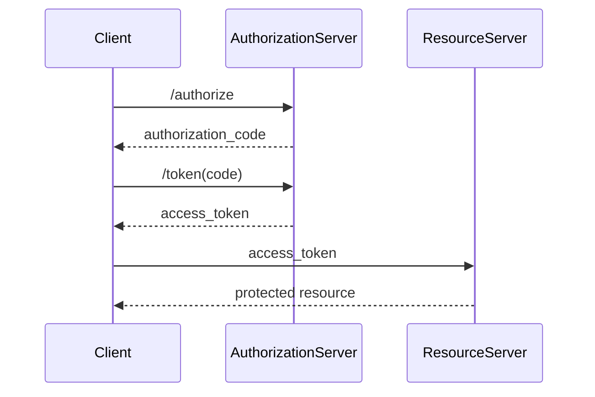

This is a fundamental distinction in OAuth. The **authorization code** and the **access token** have different semantics and live in different phases of the protocol.

---

# High-level intuition

Think of a hotel.

* **Authorization code** = claim ticket you receive at reception.
* **Access token** = room key you receive after presenting the claim ticket.

The claim ticket does **not** open your room.

The room key does.

---

# Authorization code

The authorization code is a **temporary protocol artifact**.

Its only purpose is to continue the OAuth protocol.

Properties:

* very short lifetime (typically 1–10 minutes)
* single use
* cannot access APIs
* only exchanged at the `/token` endpoint
* bound to a client (and, with PKCE, to a code verifier)

Semantically,

$$
Code : \text{AuthorizationProof}
$$

---

# Access token

The access token is a **capability**.

It authorizes resource access.

Properties:

* presented to resource servers
* contains or references permissions
* expires after some time
* can be revoked
* may be a JWT or an opaque token

Semantically,

$$
Token : \text{Capability}
$$

---

# Different protocol phases



Notice:

The **authorization code never reaches the resource server**.

The **access token never goes back to the authorization endpoint**.

---

# Algebraically

The protocol has two distinct morphisms.

First

$$
f :
AuthorizationRequest
\rightarrow
AuthorizationCode
$$

Second

$$
g :
AuthorizationCode
\rightarrow
AccessToken
$$

Composition

$$
g\circ f :
AuthorizationRequest
\rightarrow
AccessToken
$$

The authorization code is the intermediate object.

---

# Why not issue the token immediately?

Historically, browsers redirect through the user's device.

If the token were returned directly in the redirect,

```
Browser

↓

Redirect

↓

Access Token
```

then

* browser history
* logs
* referrer headers
* malicious extensions
* interception

could expose it.

Instead

```
Browser

↓

Authorization Code

↓

Backend/CLI exchanges securely

↓

Access Token
```

Only the client exchanges the code for the token over a direct HTTPS connection.

PKCE further ensures that only the original client instance can perform that exchange.

---

# Do they form a Cartesian product?

Generally, **no**.

A Cartesian product

$$
Code \times Token
$$

means every code can be paired with every token independently.

OAuth intentionally does **not** have this property.

Instead there is a **partial functional relationship**.

You can model it as

$$
exchange :
AuthorizationCode
\rightharpoonup
AccessToken
$$

where (\rightharpoonup) denotes a partial function because:

* a code may be expired,
* already used,
* revoked,
* invalid,
* fail PKCE verification.

Only some codes map to a token.

---

# Better categorical model

The protocol is a sequence of objects:

$$
AuthorizationRequest
\rightarrow
AuthorizationCode
\rightarrow
AccessToken
\rightarrow
ProtectedResource.
$$

Each arrow is a verified transformation.

---

# What does the server store?

Typically something like

```rust
struct AuthorizationCode {
    code: String,
    client_id: ClientId,
    user_id: UserId,
    redirect_uri: RedirectUri,
    pkce_challenge: CodeChallenge,
    scopes: ScopeSet,
    expires_at: Instant,
    used: bool,
}
```

and later

```rust
struct AccessToken {
    token: String,
    user_id: UserId,
    client_id: ClientId,
    scopes: ScopeSet,
    expires_at: Instant,
}
```

Notice that the access token is **derived from** the authorization code, but it is not embedded inside it.

---

# Where does a product appear?

The product appears in the **transition preconditions**, not as a stored data model.

The token endpoint consumes several independent inputs simultaneously:

$$
(Code,\ CodeVerifier,\ ClientIdentity,\ RedirectURI)
\longrightarrow
AccessToken.
$$

The transition can be viewed as

$$
exchange :
Code
\times
CodeVerifier
\times
ClientIdentity
\times
RedirectURI
\rightharpoonup
AccessToken.
$$

This is a product because all of these values are jointly required to validate the request.

By contrast, the relationship between an authorization code and the resulting access token is not a Cartesian product. It is a **state transition** (or partial function) in the OAuth protocol: a valid authorization code can be redeemed at most once to produce a new access token (and often a refresh token).
