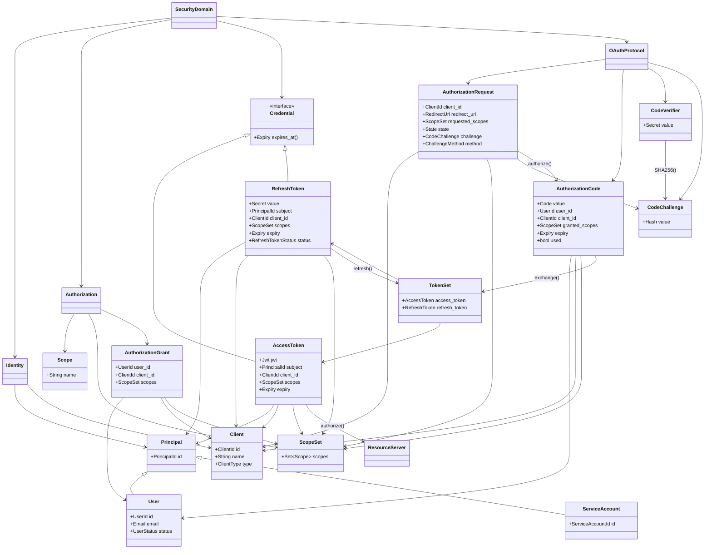

Here is the hierarchy as a Mermaid class/domain diagram. It separates **identity**, **authorization**, **credentials**, and **OAuth protocol artifacts**.

The important algebraic relationships represented:

$$
AuthorizationRequest
\rightarrow
AuthorizationCode
\rightarrow
TokenSet
\rightarrow
AccessResource
$$

and:

$$
RefreshToken
\rightarrow
TokenSet
$$

while identity is referenced:

$$
AccessToken
\rightarrow
PrincipalId
$$

rather than:

$$
AccessToken = User
$$

The diagram intentionally keeps **User**, **Client**, **Scope**, and **Token** as separate objects because they belong to different domains:

* `User` answers **who**
* `Client` answers **which application**
* `ScopeSet` answers **what permissions**
* `AccessToken` answers **what capability is currently granted**
* `RefreshToken` answers **whether renewal is allowed**
* `AuthorizationCode` answers **whether the authorization ceremony completed successfully**
