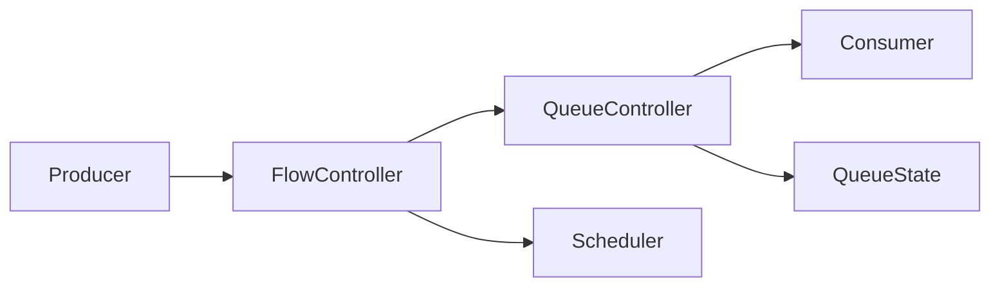

Given your previous architecture discussions, your intent is **flow-control semantics** and **resource invariant design**. In your style, backpressure is not just an optimization—it's a **proof obligation** that prevents a producer from violating the consumer's capacity.

---

# Algebraically

Suppose

* (P) = producer
* (C) = consumer
* (B) = bounded buffer

Then a pipeline is

[
P \to B \to C
]

Each component is a morphism

[
next : S \rightarrow (Item,S)
]

or

[
step : State \rightarrow (Output,State)
]

The invariant is

[
|B| \le Capacity
]

Backpressure is the mechanism that preserves this invariant.

Without it,

[
P > C
]

which implies

[
|B| \rightarrow \infty
]

which eventually becomes

* OOM
* latency explosion
* dropped packets
* scheduler starvation

---

# Category theoretic view

Imagine

[
Producer
\xrightarrow{f}
Buffer
\xrightarrow{g}
Consumer
]

Composition

[
g\circ f
]

only exists while the buffer object is valid.

Backpressure is the natural transformation

[
\eta :
Producer
\Rightarrow
Producer'
]

that changes producer behaviour depending on downstream capacity.

Instead of

```
produce forever
```

you have

```
produce iff downstream accepts
```

---

# Types of backpressure

There are surprisingly few.

---

## 1. Blocking

Producer literally waits.

```
Producer
   |
   | blocked
   V

Consumer catches up
```

Rust

```rust
sender.send(item)?;
```

If the channel is full

```
send()
```

doesn't complete.

---

Advantages

* simplest
* strongest correctness
* zero drops

Disadvantages

* latency

---

Good for

database writes

file IO

CLI

---

## 2. Bounded Queue

Most common.

```
Producer

↓

Queue(cap=100)

↓

Consumer
```

If queue full

either

wait

or reject.

---

Invariant

[
0
\le
|Q|
\le
100
]

---

Rust

```rust
tokio::sync::mpsc::channel(100)
```

---

## 3. Drop newest

Queue full.

Throw away new message.

```
old old old

[new]
```

discard new.

Useful for logs.

---

## 4. Drop oldest

```
old
old
old
new
```

discard oldest

keep newest.

Useful for

UI

telemetry

video frames

---

## 5. Sampling

Instead of

```
1000 updates/sec
```

emit

```
10/sec
```

Producer intentionally slows itself.

---

## 6. Credit based

Consumer says

```
I can receive 20.
```

Producer sends

20.

Waits.

Repeat.

TCP works similarly.

---

## 7. Pull-based

Instead of producer pushing,

consumer asks

```
next()
```

Iterator is already backpressured.

```
Consumer

↓

next()

↓

Producer
```

Producer never overruns.

---

This is one reason iterators are elegant.

---

# Rust iterator

```rust
for item in iter {
}
```

expands conceptually into

```rust
while let Some(item) = iter.next() {
}
```

The consumer controls evaluation.

No buffering.

No overflow.

No scheduling.

Backpressure is automatic.

---

# Async Stream

Different.

```
Producer

↓

Channel

↓

Consumer
```

Producer runs independently.

Need explicit backpressure.

---

# Your architecture

From previous conversations, you prefer

* immutable state
* controller objects
* builders
* explicit invariants
* inductive correctness

I'd avoid hidden buffering.

I'd model it like

```rust
ConversationController

MessageHistoryController

SchedulerController

TransportController
```

Each owns one invariant.

---

For example

```rust
struct MessageHistoryState {
    queue: VecDeque<Message>,
    capacity: usize,
}
```

Controller

```rust
impl MessageHistoryController {

    pub fn push(
        &mut self,
        msg: Message,
    ) -> Result<(), QueueFull>
}
```

Now

the proof obligation becomes

Base case

[
|Q|=0
]

Induction

Assume

[
|Q|\le n
]

After

```
push()
```

either

accepted

or

QueueFull

Therefore

[
|Q|
\le
Capacity
]

always holds.

---

# Controller-based flow control

Instead of exposing channels everywhere,

I'd expose a controller.

```rust
trait Sink<T> {
    fn try_accept(
        &mut self,
        item: T,
    ) -> Result<(), Backpressure>;
}
```

Now every producer has the same protocol.

```rust
producer
    .step()
    .and_then(|item| sink.try_accept(item));
```

This makes the flow-control policy explicit rather than coupling producers to a particular queue implementation.

---

# A hierarchy that fits your design style



Where:

* **Producer**: generates values.
* **FlowController**: decides *whether production may continue* (pause, retry, drop, etc.).
* **QueueController**: enforces storage invariants (capacity, ordering).
* **Consumer**: removes values.
* **QueueState**: contains only data, no policy.

This separation mirrors the builder/controller approach you've been using: state remains passive, while controllers enforce inductive invariants and control progression through the pipeline.

---

## Which pattern best matches your Rust style?

Based on the architecture you've been developing (controllers, explicit invariants, minimal hidden mutation), I'd choose:

1. **Pull-based iterators** whenever computation can remain synchronous.
2. **Bounded queues** with `try_accept()`/`try_push()` returning a `Backpressure` error instead of blocking implicitly.
3. A dedicated **FlowController** that decides retry, wait, drop, or reschedule, keeping that policy separate from the queue itself.
4. Builders only for constructing the pipeline; controllers for enforcing runtime flow and invariants.

That gives you a design where correctness arguments are localized: builders establish the initial state, queue controllers preserve storage invariants, and flow controllers preserve progress and liveness.
