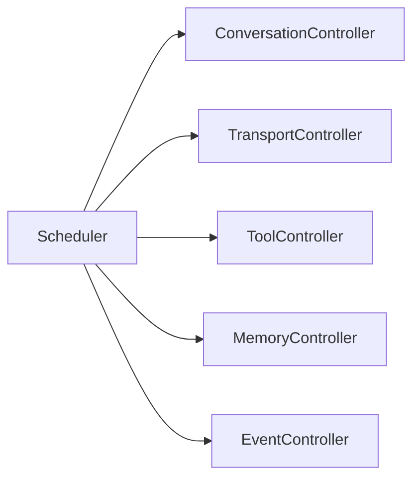
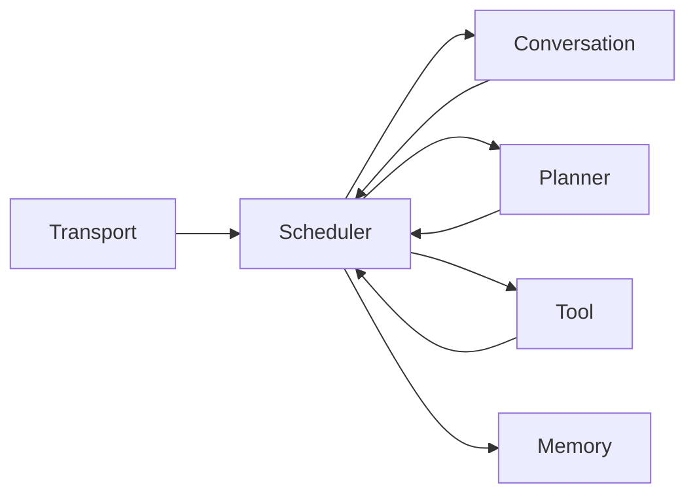

Your question is about the **control semantics** of a scheduler, not just its implementation. In your architecture, the scheduler should not "do work" itself—it should **decide which controller is allowed to advance next**.

I would formalize it this way.

---

# A scheduler is a transition selector

Suppose your runtime consists of several controllers

[
C =
{
ConversationController,
ToolController,
TransportController,
MemoryController,
AuthController
}
]

Each controller exposes a single transition

[
step :
State
\rightarrow
(State, Effect)
]

The scheduler never edits their internal state.

Instead it repeatedly chooses

[
C_i
]

to execute

[
step_i.
]

So algebraically

[
Scheduler :
RuntimeState
\rightarrow
Controller
]

followed by

[
Controller
\rightarrow
RuntimeState.
]

---

# Think of the scheduler as the conductor

Instead of

```
Scheduler owns conversations
```

think

```
Scheduler controls execution order.
```

The controllers own invariants.

The scheduler owns **time**.

---

For example



Notice

the arrows are

> "may execute"

not

> "owns"

---

# Runtime decomposition

I'd separate responsibilities like

```text
ApplicationRuntime
    |
    +-- Scheduler
    |
    +-- ConversationRuntime
    |
    +-- UserSessionRuntime
    |
    +-- EventLoop
```

ConversationRuntime owns conversations.

Scheduler owns execution order.

---

# Example

Suppose

```
User types message

↓

Transport receives

↓

Conversation updates

↓

LLM streams

↓

Tool call

↓

Database write

↓

Return output
```

Without a scheduler every component starts calling each other.

```
Transport
     |
Conversation
     |
Tool
     |
Memory
     |
Transport
```

This becomes spaghetti.

Instead

```
Scheduler

↓

TransportController.step()

↓

ConversationController.step()

↓

PlannerController.step()

↓

ToolController.step()

↓

MemoryController.step()
```

Controllers never invoke one another directly.

The scheduler does.

---

# Queue based scheduler

Imagine every controller has

```rust
trait Controller {
    fn step(&mut self) -> StepResult;
}
```

Then

```rust
loop {
    scheduler.next()?.step();
}
```

Conceptually

The scheduler decides

```
whose turn is next?
```

---

# Event-driven scheduler

Instead of polling everyone,

controllers emit events.

```
IncomingMessage

↓

Scheduler

↓

ConversationController
```

Conversation emits

```
NeedModelInference
```

Scheduler routes

```
NeedModelInference

↓

ModelController
```

Model emits

```
ToolCall
```

Scheduler routes

```
ToolController
```

---

Mermaid



Everything communicates through scheduler.

---

# Category theory

Each controller is an endomorphism

[
f_i : S \rightarrow S
]

where

[
S
=

RuntimeState.
]

Scheduler chooses

[
f_i
]

at each instant.

The runtime evolution becomes

[
S_0
\xrightarrow{f_1}
S_1
\xrightarrow{f_4}
S_2
\xrightarrow{f_2}
S_3
\cdots
]

Notice

scheduler **doesn't modify the state**.

It chooses

which morphism to compose next.

---

# Scheduler vs Controller

This distinction is important.

Controller

```text
"What is the correct transition?"
```

Scheduler

```text
"When should that transition occur?"
```

So

```rust
ConversationController::step()
```

knows

* message validation
* history updates
* invariants

It does **not** know

* priorities
* fairness
* timers
* retries
* concurrency

Those belong to

```rust
Scheduler
```

---

# In your architecture

Given your preference for builders, controllers, and explicit inductive invariants, I'd model the scheduler as **another controller over execution**, rather than as a global orchestrator with business logic.

For example:

```rust
trait Schedulable {
    fn is_ready(&self) -> bool;
    fn priority(&self) -> Priority;
    fn step(&mut self) -> StepResult;
}
```

The scheduler's algorithm is then purely:

1. Find all controllers where `is_ready() == true`.
2. Select one according to a policy (FIFO, priority, round-robin, deadlines, etc.).
3. Invoke exactly one `step()`.
4. Observe any newly emitted events and repeat.

This keeps the scheduler responsible only for **execution policy**, while each controller remains responsible only for **state correctness**. That separation aligns well with the architecture you've been converging toward: builders establish objects, controllers preserve invariants, and the scheduler composes controller transitions into the overall runtime execution.
