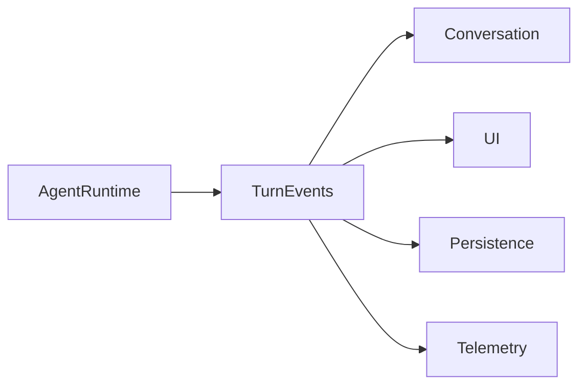
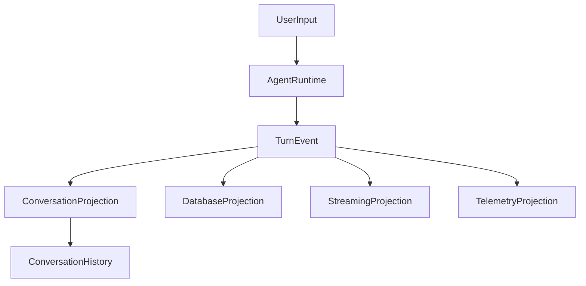

I actually think you're very close, but I'd separate **three different algebras** that are easy to conflate:

1. **Execution algebra** (what the agent computes)
2. **Persistence algebra** (what gets committed)
3. **Streaming algebra** (what gets observed)

Those should not all be represented by the same type.

---

# My decomposition

The `AgentRuntime` is a **state machine**.

Its primary operation is something like

```rust
AgentRuntime::turn(input) -> Stream<TurnEvent>
```

not

```rust
turn() -> Message
```

because a turn is *temporal*.

Formally,

$$
Turn :
(Input, RuntimeState)
\rightarrow
(RuntimeState', Event^*)
$$

where (Event^*) is a stream (or finite sequence) of events.

---

# The event algebra

Instead of immediately returning a message, define a canonical event type.

```rust
enum TurnEvent {
    Delta(TextDelta),
    ToolStarted(ToolId),
    ToolFinished(ToolResult),
    StateUpdated(StatePatch),
    AssistantMessage(Message),
    Error(TurnError),
    Finished(TurnSummary),
}
```

Notice these are **events**, not storage objects.

---

# Conversation is a projection

A conversation history is **not** the execution log.

It is a projection.

Think categorically.

Let

$$
E
$$

be the event stream.

Then

$$
\pi :
E^*
\rightarrow
ConversationHistory
$$

is a projection.

For example

```text
Delta("Hel")
Delta("lo")
ToolStarted(Search)
ToolFinished(...)
Delta(" world")
AssistantMessage(...)
Finished(...)
```

projects to

```text
Assistant:
Hello world
```

The tool events disappear.

---

# So should MessageHistory contain deltas?

I would say **no**.

I'd distinguish:

```rust
ExecutionLog
```

from

```rust
ConversationHistory
```

---

ConversationHistory should contain stable semantic messages.

```rust
enum ConversationItem {
    User(Message),
    Assistant(Message),
    Tool(ToolInvocation),
    System(SystemMessage),
}
```

---

Streaming deltas are transient.

```rust
TextDelta
```

is only for the UI.

Once complete,

```
"H"
"He"
"Hel"
"Hell"
"Hello"
```

becomes

```
Assistant("Hello")
```

---

# Where should persistence happen?

This is probably the most important architectural decision.

I would **not** let `AgentRuntime` write to the database.

Instead



Notice

AgentRuntime

doesn't know any of those exist.

It only emits events.

---

# Event sourcing viewpoint

Think

```text
AgentRuntime

↓

TurnEvent Stream

↓

Event Dispatcher

↓

Conversation
Database
Telemetry
Streaming UI
Analytics
```

Now every consumer observes the same events.

---

# TurnResult

I'd avoid making

```rust
Result<ConversationItem, TurnError>
```

because a turn produces many things.

Instead

```rust
struct TurnSummary {
    assistant_message: Option<MessageId>,
    tool_calls: Vec<ToolCallId>,
    usage: TokenUsage,
}
```

or

```rust
enum TurnCompletion {
    Finished(TurnSummary),
    Failed(TurnError),
}
```

The stream yields events and finally completes with a summary.

---

# Runtime state

Your runtime owns ephemeral state.

```rust
struct AgentRuntime {
    planner: Planner,

    executor: Executor,

    scratchpad: Scratchpad,

    pending_tools: PendingToolQueue,

    current_turn: TurnState,
}
```

Nothing here belongs in the database.

---

# Persistence layer

Then have something like

```rust
struct ConversationAggregate {
    history: Vec<ConversationItem>,
}
```

which applies events.

```rust
impl ConversationAggregate {
    fn apply(&mut self, event: &TurnEvent) {
        ...
    }
}
```

This is classic event sourcing.

---

# The complete algebra

I'd describe the system as



Mathematically, if (E) is the free monoid of events,

$$
E^*
$$

then every downstream component is a fold (catamorphism)

$$
\phi_i : E^* \rightarrow S_i,
$$

where:

* (\phi_{\text{conversation}}) builds the durable conversation history.
* (\phi_{\text{database}}) produces persistent storage updates.
* (\phi_{\text{telemetry}}) accumulates metrics.
* (\phi_{\text{ui}}) derives a stream of display updates.

This is more compositional than having the `AgentRuntime` directly mutate a `ConversationHistory` or write to a database. The runtime has a single responsibility—producing the canonical event stream—and every durable or observable view is derived from that stream. That separation also makes replay, testing, auditing, and alternative projections (e.g., analytics or debugging traces) straightforward without coupling execution to storage.
