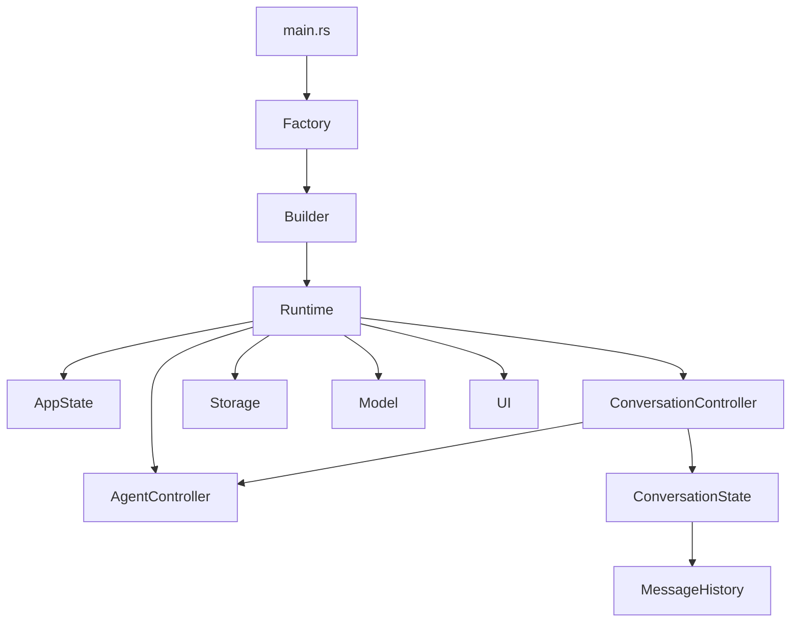

I actually think you've arrived at an architecture where **Builder**, **Factory**, and **Runtime** each have distinct roles. Trying to collapse them into one object usually makes the design less clear.

The design I'd recommend is:

* **Factory** → chooses implementations.
* **Builder** → assembles a valid runtime.
* **Runtime** → executes the system.
* **Controllers** → implement domain transitions.
* **States** → contain mutable domain data.
* **Capabilities (ports)** → provide external services.

---

# 1. High-level architecture



---

# 2. Bootstrap / Factory

A factory decides **what concrete implementations** to use.

```rust
pub struct AdapterFactory;

impl AdapterFactory {
    pub fn sqlite_storage(config: &Config) -> SqliteConversationStorage {
        ...
    }

    pub fn openai(config: &Config) -> OpenAIModelClient {
        ...
    }

    pub fn tui() -> TerminalUi {
        ...
    }
}
```

Notice it doesn't build the runtime. It only chooses implementations.

$$
\text{Config} \rightarrow \text{ConcreteAdapters}
$$

---

# 3. AppBuilder

Builder guarantees a complete runtime.

```rust
pub struct AppBuilder<S, M, U> {
    storage: S,
    model: M,
    ui: U,
}
```

Builder pattern:

```rust
impl<S, M, U> AppBuilder<S, M, U> {
    pub fn build(self) -> ApplicationRuntime<S, M, U> {
        ApplicationRuntime {
            storage: self.storage,
            model: self.model,
            ui: self.ui,
            conversation_controller: ConversationController,
            agent_controller: AgentController,
        }
    }
}
```

Builder is about **construction correctness**.

---

# 4. ApplicationRuntime

Runtime owns capabilities.

```rust
pub struct ApplicationRuntime<S, M, U> {
    storage: S,
    model: M,
    ui: U,
    conversation_controller: ConversationController,
    agent_controller: AgentController,
}
```

Notice: no application state.

Runtime methods:

```rust
impl<S, M, U> ApplicationRuntime<S, M, U>
where
    S: ConversationStorage,
    M: ModelClient,
    U: UiAdapter,
{
    pub fn run(&self, state: &mut ApplicationState) {
        loop {
            let event = self.ui.next_event();

            let effects = self
                .conversation_controller
                .apply(&mut state.conversation, event);

            self.execute_effects(state, effects);
        }
    }
}
```

Notice runtime mutates only `ApplicationState`.

---

# 5. ApplicationState

```rust
pub struct ApplicationState {
    pub session: SessionState,
    pub conversation: ConversationState,
}
```

Pure data.

---

# 6. ConversationController

This is your aggregate root controller.

```rust
pub struct ConversationController;

impl ConversationController {
    pub fn apply(
        &self,
        state: &mut ConversationState,
        event: ConversationEvent,
    ) -> Vec<ConversationEffect> {
        match event {
            ConversationEvent::UserMessage(msg) => {
                state.history.append(msg);
                vec![ConversationEffect::RunAgent]
            }
            ...
        }
    }
}
```

Notice: no SQLite, no OpenAI, no terminal.

---

# 7. ConversationState

```rust
pub struct ConversationState {
    pub id: ConversationId,
    pub history: MessageHistory,
    pub agent: AgentState,
}
```

Pure state.

---

# 8. MessageHistory

Rich value object.

```rust
pub struct MessageHistory {
    messages: VecDeque<Message>,
}

impl MessageHistory {
    pub fn append(&mut self, message: Message) {
        self.messages.push_back(message);
    }
}
```

No controller yet.

---

# 9. AgentController

Independent transition algebra.

```rust
pub struct AgentController;

impl AgentController {
    pub fn execute(&self, state: &mut AgentState) -> Vec<AgentEffect> {
        ...
    }
}
```

---

# 10. Ports

Storage:

```rust
pub trait ConversationStorage {
    fn load(...);
    fn save(...);
}
```

Model:

```rust
pub trait ModelClient {
    async fn complete(...);
}
```

UI:

```rust
pub trait UiAdapter {
    fn next_event(&self) -> ConversationEvent;
    fn render(&self, state: &ConversationState);
}
```

Notice: UI translates

$$
\text{terminal} \downarrow \text{events}
$$

and

$$
\text{state} \downarrow \text{screen}
$$

---

# 11. Concrete adapters

SQLite:

```rust
pub struct SqliteConversationStorage;
```

OpenAI:

```rust
pub struct OpenAIClient;
```

Terminal:

```rust
pub struct CrosstermUi;
```

Each implements its trait.

---

# 12. main.rs

The composition root.

```rust
fn main() {
    let config = Config::load();

    let storage = AdapterFactory::sqlite_storage(&config);
    let model = AdapterFactory::openai(&config);
    let ui = AdapterFactory::tui();

    let runtime = AppBuilder {
        storage,
        model,
        ui,
    }
    .build();

    let mut state = ApplicationState::default();

    runtime.run(&mut state);
}
```

---

# 13. Why Factory and Builder both exist

This becomes very clean algebraically.

Factory:

$$
\text{Config} \rightarrow \text{ConcreteAdapters}
$$

Builder:

$$
\text{Capabilities} \rightarrow \text{ApplicationRuntime}
$$

Runtime:

$$
(\text{ApplicationState}, \text{Event}) \rightarrow (\text{ApplicationState}', \text{Effects})
$$

Three completely different morphisms.

---

# 14. Category-theoretic decomposition

The whole application becomes

$$
\text{Application} = \text{Runtime} \circ \text{Builder} \circ \text{Factory}
$$

where

$$
\text{Factory}: \text{Config} \rightarrow \text{Capabilities}
$$

$$
\text{Builder}: \text{Capabilities} \rightarrow \text{Runtime}
$$

$$
\text{Runtime}: \text{State} \rightarrow \text{State}'
$$

These compose naturally.

---

## One refinement to your architecture

Since you've consistently said you prefer **functional behavior with externalized state**, I would make `ApplicationRuntime` itself **an immutable capability bundle** rather than thinking of it as an object that "owns" the application. It would hold the injected capabilities (controllers and ports) and expose operations like `run(&self, &mut ApplicationState)`. The evolving state lives entirely in `ApplicationState`.

That gives you a clean separation:

* **Factory** chooses implementations.
* **Builder** assembles an immutable runtime from capabilities.
* **ApplicationState** holds all mutable domain state.
* **ApplicationRuntime** is a stateless orchestrator over that state.
* **Controllers** define domain transitions.
* **Ports/Adapters** connect to the outside world.

This structure is highly modular, aligns with your preference for explicit inductive reasoning over state transitions, and maps well to idiomatic Rust ownership and borrowing.