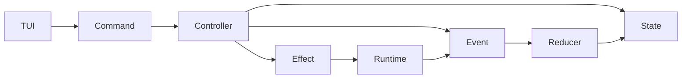
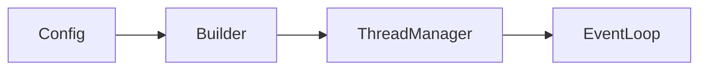

Your architecture question is really about **placing boundaries between intent, observation, state evolution, and effects**.

A clean decomposition is:

$$
User/External\ World
\rightarrow
Command
\rightarrow
Controller
\rightarrow
Event
\rightarrow
Reducer/State
\rightarrow
Effect
\rightarrow
World
$$

But for a TUI application, there are some practical simplifications.

---

# 1. Define the layers

A good Rust/TUI architecture:



Layers:

| Layer        | Responsibility                          |
| ------------ | --------------------------------------- |
| TUI          | Convert keyboard/UI actions into intent |
| Command      | "What the user wants"                   |
| Controller   | Validate + orchestrate                  |
| Event        | Facts that occurred                     |
| State        | Current truth                           |
| Reducer      | Pure state transition                   |
| Effect       | Things requiring the outside world      |
| Runtime loop | Drives everything                       |

---

# 2. What should be a Command?

A command represents **intent**.

The TUI creates commands.

Example:

```rust
enum Command {
    Quit,
    Login,
    SendMessage(String),
    SelectConversation(ConversationId),
    RunAgent,
    CancelTask(TaskId),
}
```

The user pressed:

```
q
```

The TUI does:

```rust
Command::Quit
```

It does not directly mutate state.

Why?

Because:

```
keypress != reality
```

The user requested quitting.

The application decides whether quitting is allowed.

---

Algebraically:

$$
Command \in C
$$

and:

$$
TUIInput \rightarrow Command
$$

---

# 3. What should be an Event?

Events are facts.

Examples:

```rust
enum Event {
    LoggedIn(User),
    LoginFailed(AuthError),

    MessageReceived(Message),

    AgentStarted(AgentId),
    AgentFinished(Result),

    TaskCancelled(TaskId),

    ShutdownCompleted,
}
```

These are things that happened.

---

Algebraically:

$$
Event \in E
$$

A command:

$$
"please login"
$$

becomes:

$$
"authentication succeeded"
$$

---

# 4. The controller

Your controller sits here:

```rust
struct AppController {
    auth: Authenticator,
    agent: AgentController,
    storage: Storage,
}
```

It receives commands:

```rust
impl AppController {

    fn handle(
        &self,
        state: &AppState,
        command: Command
    ) -> Output
}
```

where:

```rust
enum Output {
    Events(Vec<Event>),
    Effects(Vec<Effect>),
}
```

Mathematically:

$$
Controller:
S\times C
\rightarrow
(S,\ Events,\ Effects)
$$

---

Example:

Command:

```rust
Command::Login
```

Controller:

```
check current state
start OAuth flow
```

Produces:

```rust
Effect::OpenBrowser(url)
```

Later:

```rust
Event::LoggedIn(user)
```

---

# 5. Reducer

Reducer only handles facts.

```rust
fn reduce(
    state: AppState,
    event: Event
)
-> AppState
```

Example:

Before:

```rust
AuthState::Waiting
```

Event:

```rust
LoggedIn(user)
```

After:

```rust
AuthState::Authenticated(user)
```

Algebra:

$$
reduce:S\times E\rightarrow S
$$

---

# 6. Where Builder goes

Builder exists before the loop.

Not inside.

Your startup:



Example:

```rust
let app =
    AppBuilder::new()
        .storage(storage)
        .auth(auth)
        .agent(agent)
        .build()?;
```

Builder guarantees:

* dependencies exist
* invariants hold
* runtime can start

---

# 7. Where typestate goes

Do not use typestate for every application state.

Use it for **lifecycle states**.

Good:

```rust
App<Created>

App<Initialized>

App<Running>

App<Shutdown>
```

Example:

```rust
struct App<S> {
    controller: Controller,
    _state: PhantomData<S>
}
```

Transitions:

```rust
impl App<Initialized> {

    fn run(self)
        -> App<Running>
    {
        ...
    }
}
```

Now:

```rust
app.handle_event()
```

only exists on:

```rust
App<Running>
```

---

# 8. Internal domain state should usually be enums

For example:

```rust
enum AgentState {
    Idle,
    Planning,
    Executing,
    Waiting,
}
```

Not:

```rust
Agent<Planning>
Agent<Executing>
```

because these are dynamic states.

Your agent changes thousands of times.

Typestate is for:

"this object is allowed to perform this operation."

---

# 9. The complete architecture

For your agent harness / microkernel style:

```mermaid
flowchart TD

Config --> Builder

Builder --> App<Initialized>

App<Initialized> --> App<Running>

TUI --> Command

Command --> Controller

Controller --> Effect

Effect --> Runtime

Runtime --> Event

Event --> Reducer

Reducer --> State

State --> TUI
```

---

# 10. Concrete Rust shape

Something like:

```rust
struct ThreadManager<S> {
    controller: AppController,
    state: AppState,
    _marker: PhantomData<S>,
}


struct Running;


impl ThreadManager<Running> {

    fn dispatch(
        &mut self,
        command: Command
    ) {

        let output =
            self.controller.handle(
                &self.state,
                command
            );

        for event in output.events {
            self.state =
                reduce(self.state, event);
        }
    }
}
```

---

# 11. Decision rule

Use:

## Command when:

"someone wants something"

Examples:

```
User pressed enter
CLI requested action
API requested operation
```

---

## Event when:

"something is now true"

Examples:

```
File saved
Login succeeded
Agent completed
```

---

## Controller when:

"coordination is needed"

Examples:

```
validate
call services
choose effects
emit events
```

---

## Reducer when:

"state changes deterministically"

Examples:

```
old state + event -> new state
```

---

## Typestate when:

"the compiler should prevent misuse"

Examples:

```
cannot run before initialized
cannot send before authenticated
cannot commit before transaction opened
```

---

For your particular design, I would make:

* **Builder** → construct `ApplicationRuntime<Initialized>`
* **Typestate** → lifecycle of runtime/components
* **Controller** → command interpreter
* **Events** → facts entering the state machine
* **Reducer** → pure state evolution
* **Engine loop** → owns scheduling and effects
* **TUI** → only produces commands and renders state

This is very close to the architecture used by Elm, Redux, event-sourced systems, and many functional-core Rust applications, while still allowing practical imperative effects.
