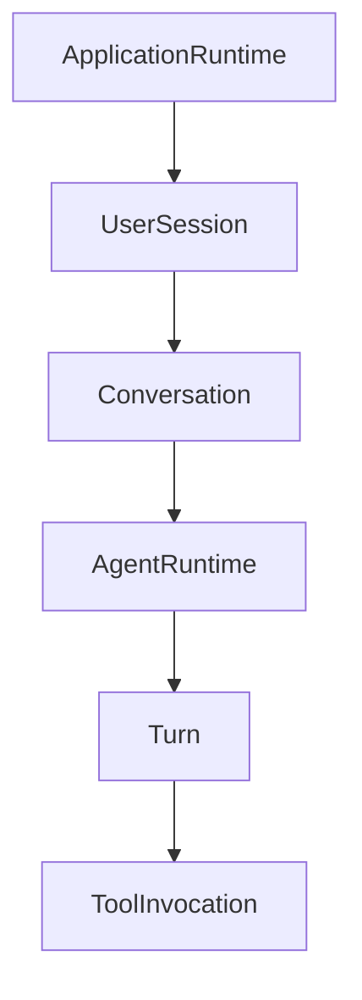
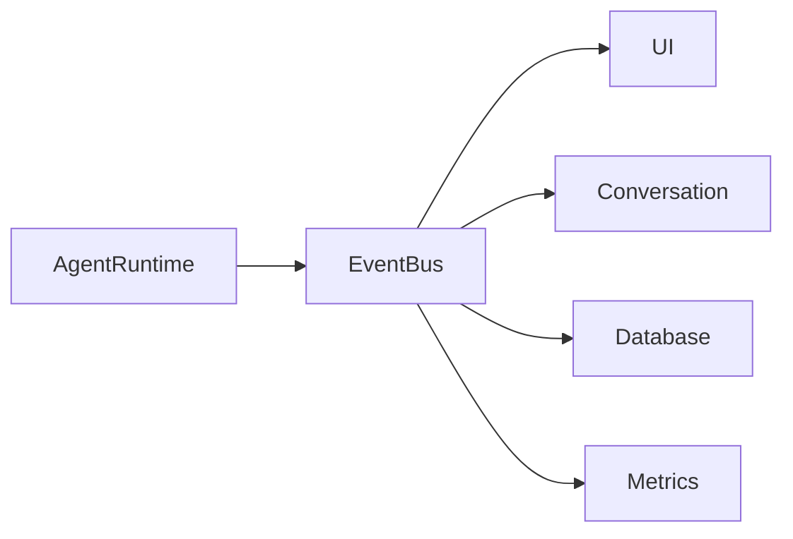
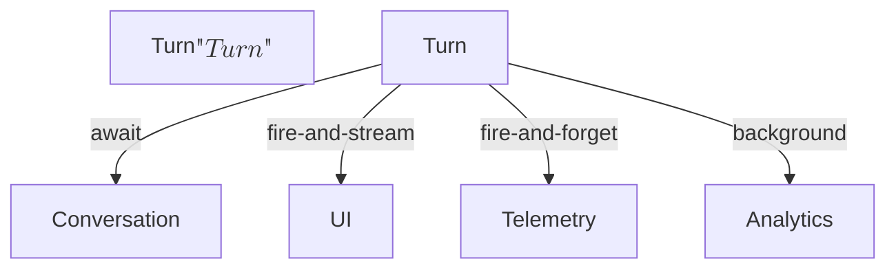

This is one of the most important architectural decisions in an agent harness. The answer comes from asking **who owns consistency**. Every async boundary is also an **aggregate boundary** because it determines where you give up atomicity.

I would decompose the system into four boundary classes.

---

# Level 0 — The ownership lattice



Each node is an aggregate.

Each aggregate has its own state space

$$
S_A
$$

and owns maintaining its invariants.

---

# Level 1 — Synchronous boundaries (inside an aggregate)

Within an aggregate, prefer synchronous method calls.

For example

```rust
AgentRuntime
    .planner()
    .executor()
    .reason()
```

These all mutate the same runtime state.

Formally,

$$
f : S \rightarrow S'
$$

or

$$
f : (S, X) \rightarrow (S', Y).
$$

There is no loss of consistency.

---

# Level 2 — Async boundaries (between aggregates)

When crossing aggregates, asynchronous communication is usually the right abstraction.

For example,

```text
AgentRuntime
        │
        ▼
Conversation
```

should not be

```rust
conversation.append(...);
```

Instead

```text
TurnFinished

↓

ConversationActor

↓

append()
```

Why?

Because Conversation has its own invariants.

It owns

```text
history

checkpoint

version

summaries

memory references
```

No other aggregate should mutate them directly.

---

# Level 3 — Event boundaries

Streaming to the UI

Database

Telemetry

Tracing

These should all consume events.



Notice

AgentRuntime

doesn't know who is listening.

---

# Level 4 — External boundaries

Model API

Filesystem

Database

Redis

HTTP

These are asynchronous because latency is externally determined.

Their algebra is

$$
Request
\rightarrow
Future<Response>.
$$

---

# Which aggregate owns the async runtime?

The Tokio runtime (or equivalent) is infrastructure.

So

```text
ApplicationRuntime

├── Tokio Runtime

├── Tool Registry

├── Model Registry

├── Database Pool
```

ApplicationRuntime owns

* task spawning
* cancellation
* shutdown
* resource pools

It should not be owned by AgentRuntime.

---

# What owns spawned tasks?

Suppose

```text
Conversation

↓

AgentRuntime

↓

ToolInvocation
```

The lifetime should be

```text
ApplicationRuntime

owns executor

↓

Conversation

owns turn

↓

Turn

owns spawned tool tasks
```

So if a turn is cancelled,

all tool tasks disappear.

This is **structured concurrency**.

Rust's `tokio::task::JoinSet` or scoped task groups fit this ownership model well.

---

# The async lattice

I would classify boundaries like this:

| Boundary                  | Sync | Async | Owner                 |
| ------------------------- | ---- | ----- | --------------------- |
| Planner → Executor        | ✓    |       | AgentRuntime          |
| Executor → Scratchpad     | ✓    |       | AgentRuntime          |
| Turn → Conversation       |      | ✓     | Conversation          |
| Turn → UI Stream          |      | ✓     | Streaming projection  |
| Turn → Telemetry          |      | ✓     | Metrics aggregate     |
| Turn → Database           |      | ✓     | Persistence aggregate |
| Tool → HTTP               |      | ✓     | ToolInvocation        |
| Model → OpenAI            |      | ✓     | ModelClient           |
| Application → Spawn Agent |      | ✓     | ApplicationRuntime    |

Notice the pattern:

> **Inside an aggregate: synchronous.**
>
> **Across aggregate boundaries: asynchronous or message-based.**

---

# Category-theoretic interpretation

Each aggregate is an object

$$
A,B,C,\ldots
$$

Internal methods are endomorphisms

$$
A \rightarrow A.
$$

Crossing an aggregate boundary produces an event

$$
A
\xrightarrow{\mathrm{emit}}
E
\xrightarrow{\mathrm{consume}}
B.
$$

Rather than

$$
A \rightarrow B,
$$

you factor communication through the event category.

This is exactly what event sourcing, actor systems, and CQRS all exploit.

---

## One refinement for an LLM agent harness

I would distinguish **latency-sensitive** from **durability-sensitive** consumers.



* **Conversation** is part of the user-visible correctness boundary. Before declaring the turn complete, persist the canonical assistant message (or at least durably enqueue it). This keeps the conversation history consistent.
* **UI streaming** is observational. It should receive deltas immediately and not block on persistence.
* **Telemetry** and **analytics** are side effects. They should not delay the user's response.

So the most important aggregate boundary is not simply "async vs sync" but **which invariants define completion**. The `Conversation` aggregate owns conversational consistency, the `AgentRuntime` owns execution consistency, and `ApplicationRuntime` owns infrastructure and task lifetimes. Each aggregate encapsulates its own state, and asynchronous boundaries appear precisely where ownership transfers from one aggregate to another.
