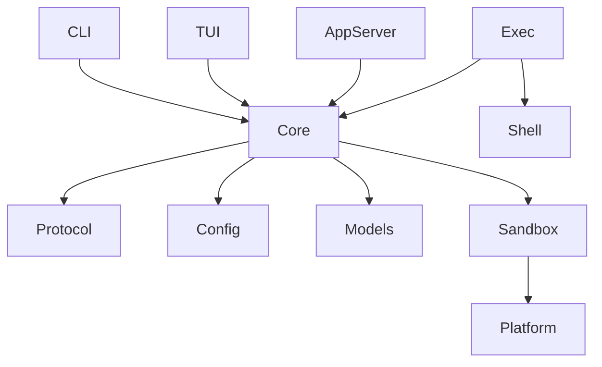
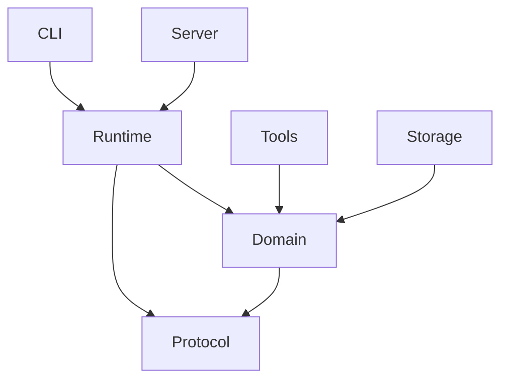

The architecture you pasted is a **Cargo workspace + layered crate architecture + multi-build-system monorepo**. It is very close to how large Rust systems (compilers, runtimes, infrastructure tools, agents) are organized.

The important idea is not "many crates". The idea is:

> **Each crate owns a coherent state space and exposes a narrow algebra of operations. Composition happens at higher layers.**

This matches the modular lattice idea you have been exploring.

---

## 1. The architectural class

The Codex structure is roughly:

$$
\text{Workspace}
=

\prod_i \text{Crate}_i
$$

where each crate is a bounded module with:

* its own types
* its own invariants
* its own tests
* its own dependency boundary

The dependency graph is a DAG:



The rule:

> Higher-level crates depend downward. Lower-level crates should not know about applications.

---

# 2. The layers they use

A useful decomposition:

## Layer 0 — Primitive/domain types

Examples:

```
protocol/
config/
models/
utils/
```

These are pure semantic definitions.

Example:

```rust
pub enum Event {
    UserMessage(String),
    ToolCall(ToolRequest),
    Response(Response),
}
```

This crate should know almost nothing.

Dependency direction:

```
protocol
    ^
    |
everything else
```

Think:

$$
\text{Protocol} = \text{shared language}
$$

---

# Layer 1 — Domain engines

Example:

```
core/
```

This is the actual agent runtime.

It owns:

* sessions
* state machines
* orchestration
* event processing

Example:

```rust
pub struct AgentRuntime {
    session: Session,
    tools: ToolRegistry,
    model: ModelClient,
}
```

Notice:

The runtime owns mutation.

Not:

```rust
execute(state)->new_state
```

but:

```rust
runtime.execute(event)
```

because:

$$
Runtime : State \times Event \rightarrow State
$$

The runtime is the state machine.

---

# Layer 2 — Adapters / interfaces

Examples:

```
cli/
tui/
app-server/
exec/
```

These are different projections of the same engine.

Mathematically:

Core:

$$
C
$$

Interfaces:

$$
f_i:C\rightarrow UI_i
$$

CLI:

$$
f_{cli}: Core \rightarrow Terminal
$$

IDE server:

$$
f_{rpc}: Core \rightarrow JSONRPC
$$

TUI:

$$
f_{tui}: Core \rightarrow TerminalUI
$$

They do not implement intelligence.

They translate.

---

# Layer 3 — Infrastructure

Examples:

```
sandboxing
shell-command
otel
mcp
```

These provide capabilities.

Think:

```
Capability
    |
    +-- filesystem
    +-- shell
    +-- network
    +-- telemetry
```

The core asks:

```rust
trait Sandbox {
    fn execute(&self, cmd: Command)
}
```

Infrastructure implements:

```rust
struct LinuxSandbox;
struct DockerSandbox;
struct MacSandbox;
```

This is where Rust `dyn Trait` appears.

---

# Why Cargo workspace?

Without workspace:

```
agent/
  src/
  cli/
  core/
  protocol/
```

Everything becomes one compilation unit.

Problems:

* dependency leakage
* unclear ownership
* slow builds
* hard testing

Workspace:

```
codex-rs/

Cargo.toml

core/
Cargo.toml

cli/
Cargo.toml

protocol/
Cargo.toml
```

Each crate becomes a semantic boundary.

---

# How to integrate this into your own development process

For your projects (agent harness, mini-uv, compiler), I would copy this pattern.

---

# Stage 1 — Start as one crate

Do not prematurely create 100 crates.

Start:

```
my-agent/

src/
 ├── main.rs
 ├── runtime/
 ├── model/
 ├── tools/
 ├── memory/
 └── protocol/
```

Until you have stable concepts.

---

# Stage 2 — Extract semantic boundaries

Ask:

> Does this module have its own vocabulary and invariants?

If yes:

extract crate.

Example:

Before:

```
src/
 ├── agent.rs
 ├── package.rs
 ├── resolver.rs
```

After:

```
workspace

agent-core/
package-model/
resolver/
cli/
```

---

# Stage 3 — Create workspace

Root:

```
my-system/

Cargo.toml

crates/
    core/
    protocol/
    runtime/
    cli/
```

Root:

```toml
[workspace]
members=[
    "crates/core",
    "crates/protocol",
    "crates/runtime",
    "crates/cli"
]

resolver="2"
```

---

# Stage 4 — Define dependency direction

The most important part.

Bad:

```
core ---> cli
```

because core knows presentation.

Good:

```
cli ---> core
```

The graph should point toward abstraction.

Example:

```
cli
 |
 v
runtime
 |
 v
domain
 |
 v
types
```

---

# Stage 5 — Use traits as extension points

Codex style:

Core:

```rust
pub trait Tool {
    fn execute(&self,input:Input)->Output;
}
```

Plugins:

```rust
struct ShellTool;

impl Tool for ShellTool {
}
```

Now:

```
core
 |
 | trait
 |
 +------ shell
 +------ database
 +------ browser
```

The core does not import implementations.

---

# Stage 6 — Add multiple runtimes

This is where your "runtime owns domains" question appears.

Example:

```
agent-core
     |
     |
runtime-api
     |
 ----------------
 |              |
CLI runtime   Server runtime
```

The domain defines:

```rust
trait Runtime {
    fn run(event:Event);
}
```

Each runtime owns:

* scheduling
* lifecycle
* concurrency model

---

# Stage 7 — Add build orchestration later

Do not start with Bazel.

Typical progression:

## Small project

Cargo only:

```
Cargo workspace
```

## Medium

Add:

```
cargo-make
just
xtask
```

## Large

Add:

```
Bazel
Nix
Buck2
```

Bazel solves:

* reproducible builds
* huge dependency graphs
* cross compilation

Not architecture.

---

# Applying this to your agent harness

A possible workspace:

```
agent/

Cargo.toml

crates/

agent-protocol
    Events
    Commands
    Messages


agent-domain
    Agent
    Memory
    Tool


agent-runtime
    Scheduler
    EventLoop
    StateMachine


agent-tools
    MCP
    Browser
    Shell


agent-storage
    VectorDB
    KVStore


agent-cli


agent-server
    HTTP
    Websocket
```

Dependency:



---

# The key design heuristic

When deciding whether to create a crate:

Do not ask:

> "Is this code reusable?"

Ask:

> "Does this concept have its own laws?"

Examples:

Good crate:

```
PackageResolver
```

because it has rules:

$$
Resolve : DependencyGraph \rightarrow Solution
$$

Bad crate:

```
StringUtils
```

because it has no coherent domain.

---

The Codex architecture is essentially **hexagonal architecture + domain-driven design + Rust workspace modularity**:

$$
\boxed{
Ports
\rightarrow
Domain
\rightarrow
Adapters
}
$$

with Cargo crates enforcing the boundaries mechanically. For your style of building systems (agent runtimes, package managers, compilers), this is the right abstraction level to copy.
