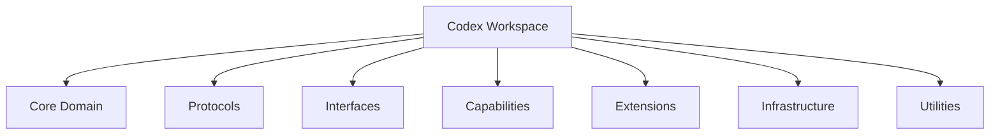
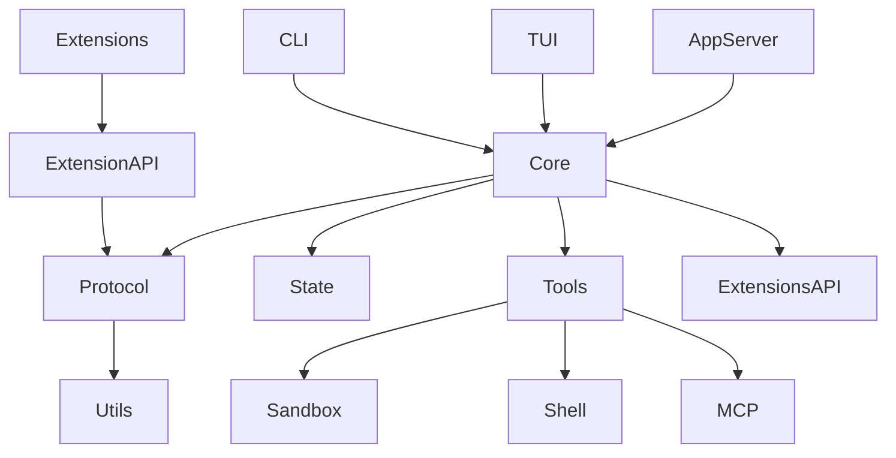

This actual workspace reveals a more interesting architecture than the simplified "core + adapters" view. This is closer to a **large-scale capability-oriented modular monolith**.

The key abstraction is:

> They are not organizing by technical layers only. They are organizing by **bounded domains + capability crates + protocol boundaries**.

Think of it as a **directed dependency lattice** where each crate is a node with allowed morphisms (dependencies).

$$
\mathcal{C} =
(\text{Crates},\text{Dependency arrows})
$$

with the constraint:

$$
\text{No cycles}
$$

The workspace is basically a DAG of semantic modules.

---

# 1. Top-level decomposition

I would classify the crates into these families:



---

# 2. Core domain

These are the "physics" of the system.

```
core
core-api
state
thread-store
rollout
agent-identity
agent-graph-store
```

Conceptually:

$$
Agent =
(State, Memory, Identity, Graph, Events)
$$

For example:

```
core
 |
 +-- state
 |
 +-- thread-store
 |
 +-- rollout
 |
 +-- protocol
```

The important thing:

`core` should not know:

* CLI
* TUI
* HTTP
* MCP transport
* filesystem implementation

It consumes abstractions.

---

# 3. Protocol layer

This is the language between modules.

Examples:

```
protocol
app-server-protocol
exec-server-protocol
code-mode-protocol
```

This is essentially:

$$
Messages : A \rightarrow B
$$

Example:

```rust
enum AgentEvent {
    ToolStarted,
    ToolFinished,
    UserInput,
}
```

Protocols stabilize the architecture.

A protocol crate is a **category interface object**:

```
producer ---> protocol <--- consumer
```

Instead of:

```
producer ---> consumer
```

which creates coupling.

---

# 4. Capability crates

This is the biggest difference from a normal layered architecture.

Examples:

```
tools
shell-command
file-system
sandboxing
network-proxy
websocket-client
http-client
mcp
```

They represent things the agent can do.

Mathematically:

The agent has a capability algebra:

$$
Capabilities =
{filesystem, shell, network, browser, memory,...}
$$

Each capability has:

```rust
trait Capability {
    fn execute();
}
```

Then:

```
core
 |
 +---- Tool trait
          |
          +---- shell
          +---- filesystem
          +---- mcp
```

---

# 5. Extension architecture

This is the most interesting part.

They have:

```
ext/

agent
connectors
goal
guardian
image-generation
items
memories
mcp
skills
web-search
```

This is a plugin system.

The architecture is:

$$
Core
\leftarrow
Extension
$$

The extension implements contracts defined by core.

Example:

```
core-plugin
      |
      |
extension-api
      |
      |
----------------
|              |
web-search   memories
```

This allows adding features without modifying the engine.

This is the same idea as:

* VSCode extensions
* browser plugins
* compiler passes

---

# 6. Application boundary crates

These are entrypoints.

```
cli
tui
app-server
app-server-daemon
exec
mcp-server
```

They are different "front doors".

Same engine:

$$
Core
$$

different morphisms:

$$
f_1(Core)=CLI
$$

$$
f_2(Core)=TUI
$$

$$
f_3(Core)=IDE
$$

---

# 7. Utility layer

Notice they have many tiny crates:

```
utils/
    cache
    string
    template
    pty
    elapsed
    fuzzy-match
```

This is deliberate.

Why?

Because utility code is dangerous.

A giant:

```
utils.rs
```

becomes:

```
everything depends on everything
```

Instead:

```
string-utils
    |
    v
only string operations
```

Each utility has a small algebra.

---

# 8. Dependency hierarchy

A realistic picture:



The dependency gradient:

$$
Applications
\rightarrow
Domain
\rightarrow
Protocols
\rightarrow
Primitives
$$

---

# 9. How you should copy this for your own projects

For your agent harness / mini uv / compiler projects, do not copy 120 crates.

Copy the **partitioning principle**.

Start:

```
my-system/

Cargo.toml

crates/

protocol/
    events
    commands
    schemas

domain/
    state machine
    entities

runtime/
    scheduler
    execution loop

capabilities/
    filesystem
    shell
    network

extensions/
    plugins

storage/
    database
    cache

cli/
server/
```

---

# 10. When to split a crate

Use this rule:

Create a crate when it has an independent:

## 1. State space

Example:

```
PackageGraph
```

has:

$$
G=(V,E)
$$

independent laws.

---

## 2. Lifecycle

Example:

```
SessionStore
```

has:

```
open()
append()
close()
recover()
```

---

## 3. Dependency direction

If you want:

```
A depends on B
```

but B should never depend on A:

make B a crate.

---

# 11. How this maps to your category-theory framing

Each crate is a small category:

$$
C_i
$$

Dependencies are functors:

$$
F:C_i\rightarrow C_j
$$

Protocols are natural interfaces:

$$
C_i \xrightarrow{P} C_j
$$

The whole workspace is a composition:

$$
C_1
\rightarrow
C_2
\rightarrow
...
\rightarrow
C_n
$$

The architectural goal is not maximal modularity.

It is:

$$
\text{maximize independent evolution}
$$

while minimizing:

$$
\text{coupling entropy}
$$

---

The big lesson from this workspace:

**Do not organize Rust projects around folders. Organize them around stable semantic boundaries.**

The crates are not "files split apart"; they are **independent domains with contracts**. That is why a 120-crate workspace remains manageable.
