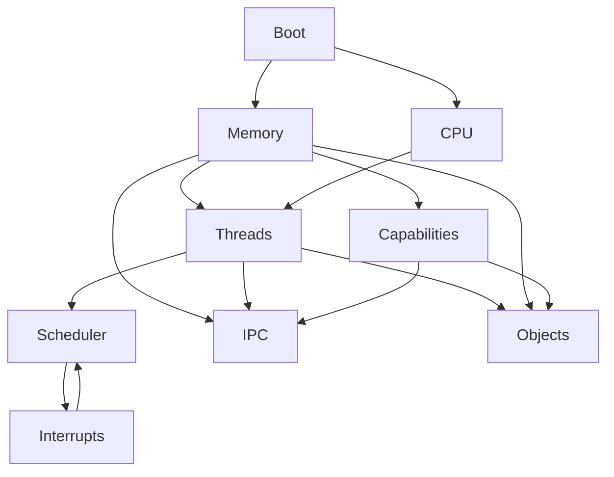

Your question is essentially asking for the **architectural decomposition lattice** of a microkernel. That is different from a module hierarchy. A lattice specification identifies:

* the partially ordered abstractions,
* their dependency constraints,
* their state spaces,
* their morphisms,
* and the refinement order.

The consensus in systems research (Mach, L4, seL4, Minix3, Zircon) is that the kernel should be the **greatest lower bound of mechanisms**, not policies.

---

# Level 0 — Complete State Space

Let

[
K
]

be the complete kernel state.

Instead of viewing it as one monolithic object,

[
K \cong
S_{cpu}
\times
S_{memory}
\times
S_{thread}
\times
S_{ipc}
\times
S_{interrupt}
\times
S_{capability}
\times
S_{scheduler}
\times
S_{boot}
\times
S_{object}
]

Each factor is approximately orthogonal.

---

# Level 1 — Fundamental Lattice

```
                    Kernel
                       │
 ┌──────────┬──────────┼──────────┬────────────┐
 │          │          │          │            │
CPU      Memory      IPC      Objects    Capabilities
 │          │          │          │            │
Threads   Address    Messages    Handles     Rights
           Spaces
```

Every child introduces a new coordinate of state.

Formally,

[
Kernel
======

\prod_i S_i
]

---

# Level 2 — CPU lattice

State

[
S_{cpu}
=======

CPU
\times
Core
\times
Registers
\times
Privilege
]

Objects

* CPU
* Core
* Context
* Trap Frame
* Exception

Operations

[
save
]

[
restore
]

[
switch
]

[
trap
]

Morphisms

```
Running
↓

Interrupted
↓

Saved

↓

Restored
```

---

# Level 3 — Thread lattice

State

[
S_{thread}
==========

ThreadId
\times
Context
\times
Priority
\times
State
]

State lattice

```
Created

↓

Runnable

↓

Running

↓

Blocked

↓

Sleeping

↓

Exited
```

Partial order

[
Created
<
Runnable
<
Running
]

while

Blocked

and

Sleeping

are incomparable.

---

# Level 4 — Virtual Memory

State

[
S_{memory}
==========

AddressSpace
\times
PageTable
\times
Mappings
\times
Permissions
]

Objects

```
Page

Frame

Address Space

Mapping

Region
```

Operations

```
map

unmap

protect

clone

fault
```

Composition

[
AddressSpace
============

\sum_i Mapping_i
]

---

# Level 5 — Capability Algebra

Modern kernels (especially seL4) revolve around capabilities.

State

[
S_{cap}
=======

Capability
\times
Object
\times
Rights
]

Morphisms

```
derive

revoke

copy

move

delete
```

Rights lattice

```
RWX

├── RW

├── RX

├── WX

├── R

├── W

└── X

↓

None
```

which is simply

[
(\mathcal P({R,W,X}),\subseteq)
]

---

# Level 6 — IPC

State

[
S_{ipc}
=======

Endpoint
\times
Queue
\times
Messages
]

Objects

```
Endpoint

Port

Channel

Message
```

Operations

```
send

receive

reply

forward
```

Transition

```
Idle

↓

Waiting

↓

Queued

↓

Delivered
```

---

# Level 7 — Scheduler

State

[
S_{sched}
=========

RunQueue
\times
PriorityQueue
\times
Timer
]

Operations

```
enqueue

dequeue

pick_next

preempt
```

Algebraically

Scheduler

is a morphism

[
RunQueue
\rightarrow
Thread
]

---

# Level 8 — Interrupts

State

[
IRQ
\times
Handler
\times
Mask
]

Objects

```
Interrupt

Vector

Handler

IRQ
```

Operations

```
mask

unmask

dispatch

acknowledge
```

---

# Level 9 — Object Model

Many kernels reduce everything to objects.

```
Kernel Object

├── Thread

├── Endpoint

├── Page

├── Frame

├── Capability

├── Timer

├── Interrupt

└── Address Space
```

This forms a coproduct

[
Object
======

Thread
+
Endpoint
+
Page
+
Frame
+\cdots
]

---

# Level 10 — Boot

Boot has its own lattice because initialization is monotonic.

```
Reset

↓

Early Memory

↓

Paging

↓

Interrupts

↓

Scheduler

↓

Userspace

↓

Idle
```

Every transition adds invariants.

---

# Complete Product Algebra

Putting everything together,

[
Kernel
\cong
S_{cpu}
\times
S_{memory}
\times
S_{thread}
\times
S_{ipc}
\times
S_{cap}
\times
S_{interrupt}
\times
S_{scheduler}
\times
S_{boot}
\times
S_{object}
]

Each component is itself an algebra.

---

# Dependency Lattice

A clean dependency order is



The direction means "provides mechanisms required by."

---

# Categorical Specification

You can model the microkernel as a category:

* **Objects**: kernel states.
* **Morphisms**: kernel operations (system calls, interrupts, scheduling steps, page mappings, IPC operations).
* **Product**: independent subsystems (CPU × Memory × IPC × Scheduler).
* **Coproduct**: heterogeneous kernel object types.
* **Monoids**: event logs, interrupt streams, scheduler traces.
* **Functors**: projections from the global kernel state to subsystem views.
* **Natural transformations**: coherent changes across subsystem implementations (e.g., swapping one scheduler policy for another while preserving the scheduling interface).
* **Initial algebra**: boot-time construction of kernel objects.
* **Final coalgebra**: the ongoing execution of the operating system as an infinite transition system.

## High-ROI project decomposition

For a pedagogical microkernel project, a refinement lattice that balances conceptual clarity with implementation order is:

| Level | Aggregate            | Main algebra             | Depends on           |
| ----: | -------------------- | ------------------------ | -------------------- |
|     0 | Boot                 | Initialization algebra   | —                    |
|     1 | CPU/Architecture     | Context-switch algebra   | Boot                 |
|     2 | Physical Memory      | Allocation algebra       | Boot                 |
|     3 | Virtual Memory       | Mapping algebra          | CPU, Physical Memory |
|     4 | Kernel Object System | Sum type algebra         | Virtual Memory       |
|     5 | Threads              | State-transition algebra | CPU, Objects         |
|     6 | Scheduler            | Priority/queue algebra   | Threads              |
|     7 | IPC                  | Message-passing algebra  | Threads, Objects     |
|     8 | Capabilities         | Permission lattice       | Objects, IPC         |
|     9 | Interrupts & Timers  | Event algebra            | Scheduler            |
|    10 | Userspace & Syscalls | Interface algebra        | All previous         |

This ordering closely matches the refinement process used in verified kernels such as seL4: each layer introduces a new coordinate of state while depending only on lower lattice elements, minimizing cyclic dependencies and making invariants easier to state and prove.
