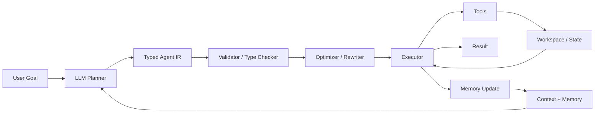
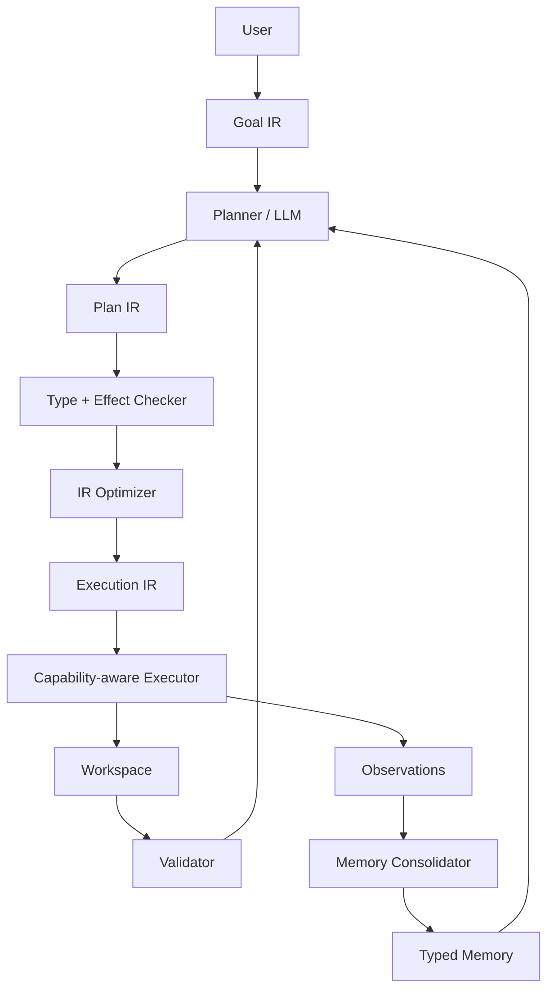

Yes. The strongest way to use the ideas you've been developing is to treat a **code agent as a compiler/interpreter over an explicitly typed intermediate representation**, rather than as "an LLM that calls tools."

The central design principle is:

[
\boxed{
\text{Agent}
============

\text{state}
+
\text{typed transformations}
+
\text{IR}
+
\text{semantic invariants}
+
\text{effectful execution}
}
]

Your curry/product ideas become useful because they tell you how to **factor the agent's state and computations without changing their semantics**.

---

# 1. Start with the raw agent as a state transformer

Let:

* (C) = conversation/context
* (M) = persistent memory
* (W) = workspace/codebase state
* (T) = available tools
* (G) = current goal
* (E) = environment

Then the naïve agent is something like:

[
Agent:
C\times M\times W\times G\times E
\to
Action\times M'\times W'.
]

That's mathematically fine, but terrible as an implementation interface.

You have a giant product:

[
C\times M\times W\times G\times E.
]

The first architectural move is to **factor it**.

---

# 2. Curry the agent's computation

Instead of thinking:

[
Agent:
C\times M\times W\times G\times E
\to Result,
]

you can represent it as:

[
C\to
(M\to
(W\to
(G\to
(E\to Result)))).
]

This doesn't magically make the agent better. It gives you a **compositional representation**.

You can partially specialize it.

For example:

[
Agent(c,m,w,-,-)
]

is now a computation specialized to a particular conversation, memory, and workspace.

This becomes conceptually related to:

* dependency injection,
* closures,
* environments,
* partial evaluation,
* middleware,
* configuration,
* compiler specialization.

---

# 3. But don't actually implement the agent as five nested functions

This is where the IR idea becomes powerful.

Instead, define a structured state:

```rust
struct AgentState {
    goal: Goal,
    context: Context,
    memory: Memory,
    workspace: Workspace,
    environment: Environment,
}
```

and an IR:

```rust
enum Op {
    ReadMemory(Query),
    SearchCode(Query),
    ReadFile(Path),
    WriteFile(Path, Content),
    RunCommand(Command),
    CallTool(ToolCall),
    Think(ReasoningTask),
    Finish(Result),
}
```

Now the LLM isn't directly mutating reality.

It produces:

[
IR
]

and another subsystem interprets it.

---

# 4. The architecture becomes compiler-like



This gives you a very important separation:

[
\boxed{
\text{LLM proposes computation}
}
]

versus

[
\boxed{
\text{runtime determines whether computation is valid}
}
]

That's exactly analogous to:

[
\text{source program}
\to
\text{IR}
\to
\text{type checking}
\to
\text{optimization}
\to
\text{execution}.
]

---

# 5. The agent IR is where your algebra becomes useful

Suppose the model produces:

```text
ReadFile("src/auth.rs")
Search("permission")
ReadFile("src/security.rs")
ModifyFile(...)
RunTests(...)
```

Don't represent that merely as a list of strings.

Represent it as a typed computation:

[
Op_1;Op_2;Op_3;Op_4;Op_5.
]

More formally, you can view the IR as a small language whose terms have types.

For example:

[
ReadFile:
Path\to File
]

[
Search:
(Query,Workspace)\to SearchResult
]

[
Modify:
(File,Patch)\to Workspace'
]

[
RunTests:
Workspace\to TestResult.
]

Now the planner has to produce something that type-checks.

---

# 6. This is where your "orthogonal product" idea becomes extremely useful

Suppose:

[
ReadFile:p\to File
]

and:

[
Search:q\to SearchResult.
]

If they don't depend on each other's outputs, you have:

[
p\times q
]

as independent inputs.

You can represent:

[
ReadFile(p)\times Search(q).
]

Instead of forcing:

[
ReadFile(p);
Search(q)
]

sequentially.

The optimizer can discover:

[
\boxed{
Dependency(ReadFile,Search)=\varnothing
}
]

and execute them concurrently.

So the algebraic idea becomes:

[
\text{product decomposition}
\Rightarrow
\text{dependency analysis}
\Rightarrow
\text{parallel execution}.
]

That's a very real compiler architecture principle.

---

# 7. Your ordering idea gives you another layer: agent plans form a partial order

Suppose the agent wants:

[
ReadFile
\prec
Analyze
\prec
Patch
\prec
Test.
]

This isn't necessarily a total sequence.

You might have:

[
ReadFile(A)
]

and:

[
ReadFile(B)
]

independent of each other.

Then:

[
ReadFile(A)\parallel ReadFile(B)
]

followed by:

[
Analyze(A,B).
]

So the plan naturally becomes a DAG.

Mathematically:

[
Plan=(V,\preceq)
]

where:

* (V) = operations,
* (\preceq) = dependency/order relation.

Then the executor chooses a linear extension of the partial order.

This is one of the strongest ways to turn your order-theoretic thinking into an agent runtime.

---

# 8. Memory should also be typed—not one giant vector database

I would strongly avoid:

[
Memory = \text{everything we've ever seen}.
]

Instead factor it:

[
M=
M_{episodic}
\times
M_{semantic}
\times
M_{procedural}
\times
M_{workspace}.
]

For example:

[
M_{episodic}
============

\text{past interactions}
]

[
M_{semantic}
============

\text{facts about the project}
]

[
M_{procedural}
==============

\text{known workflows/preferences}
]

[
M_{workspace}
=============

\text{current code state}.
]

Then retrieval becomes typed:

[
Retrieve:
Query\times M_i\to Evidence.
]

Instead of asking:

> "Search memory."

you ask:

[
Retrieve_{semantic}(q)
]

or:

[
Retrieve_{procedural}(q).
]

That gives your memory system a **type discipline**.

---

# 9. The IR can explicitly represent memory dependencies

For example:

```rust
enum Op {
    RetrieveSemantic(Query),
    RetrieveProcedural(Query),
    ReadCode(Path),
    InspectGit(Diff),
    GeneratePatch(Plan),
    ApplyPatch(Patch),
    RunTests(TestPlan),
}
```

Now a plan might be:

[
RetrieveProcedural(q)
\rightarrow
ReadCode(p)
\rightarrow
GeneratePatch(...)
\rightarrow
ApplyPatch(...)
\rightarrow
RunTests(...).
]

The important thing is that memory retrieval becomes a **first-class computation**, rather than invisible prompt decoration.

---

# 10. And now your curry idea gives you dependency injection naturally

Suppose a tool needs:

[
Tool:
Credentials\times Environment\times Input
\to
Output.
]

Instead of passing all three everywhere, curry it:

[
Credentials
\to
(Environment\to
(Input\to Output)).
]

Then instantiate:

[
tool_{env,cred}:Input\to Output.
]

This is essentially what you were getting at with:

```python
app = with_database(db)
app = with_auth(auth)
app = with_logging(logger)
```

Each wrapper is **partial application / composition of an environment with a computation**.

So your agent runtime could construct:

[
Executor:
Environment\to(IR\to Result).
]

Then instantiate:

[
executor_{env}:IR\to Result.
]

That is a very clean architecture.

---

# 11. The OOP version and functional version are then just different factorizations

Functional:

[
execute:
Environment\times IR\to Result.
]

Curried:

[
Environment\to(IR\to Result).
]

Object-oriented:

```rust
struct Executor {
    environment: Environment,
}

impl Executor {
    fn execute(&self, ir: IR) -> Result {
        ...
    }
}
```

These are semantically very close.

The OOP object:

[
Executor=(Environment,execute)
]

packages the environment and behavior.

The functional version keeps them explicit:

[
Environment\times IR\to Result.
]

This is exactly the representation-level equivalence you were exploring earlier.

---

# 12. Where "design style" enters

Now you can define a **design policy** over the IR.

For example, the agent could prefer:

### Small composable functions

Instead of:

```text
modify_everything()
```

prefer:

[
Read
\to
Analyze
\to
Transform
\to
Validate
\to
Write.
]

### Pure transformations

Prefer:

[
Code\to Code'
]

over:

[
Code\to World
]

when possible.

### Explicit effects

Mark:

[
ReadFile
]

as an effect, while:

[
ParseAST
]

is pure.

### Narrow capabilities

Give an operation:

[
WriteFile(Path)
]

rather than unrestricted:

[
Shell().
]

Now "coding style" becomes partially machine-checkable.

---

# 13. This leads to a very powerful effect/capability type system

You can type tools by their authority.

For example:

[
ReadFile:
Path
\xrightarrow{Read}
File.
]

[
WriteFile:
Path\times Content
\xrightarrow{Write}
Workspace.
]

[
RunShell:
Command
\xrightarrow{Exec}
Environment.
]

Then your IR can carry effect information:

[
Op:
Input
\xrightarrow{Effect}
Output.
]

So the planner can't merely ask:

> "Can I call this tool?"

The runtime asks:

[
\boxed{
\text{Does this plan possess the required capability?}
}
]

That's directly connected to your earlier security work.

---

# 14. Your agent becomes a typed effectful category

At a fairly abstract level, think:

[
\boxed{
\mathcal C
==========

\text{category of typed agent computations}.
}
]

Objects:

[
Context,\ Memory,\ File,\ AST,\ Patch,\ TestResult,\ldots
]

Morphisms:

[
ReadFile,
Parse,
Analyze,
Transform,
Write,
Test,\ldots
]

Composition:

[
g\circ f.
]

Products:

[
A\times B.
]

Function spaces:

[
B^A.
]

Effects/capabilities annotate morphisms.

Then the agent is not fundamentally "an LLM."

The LLM is a **planner/approximate morphism synthesizer**:

[
\boxed{
LLM:
(Context,Goal,AvailableOps)
\to
IR.
}
]

The trusted runtime is the interpreter:

[
\boxed{
Interpret:
IR\times State
\to
State\times Result.
}
]

---

# 15. Memory then becomes part of the semantic state

You can make the whole thing a state transition system:

[
\boxed{
Step:
State\times IR
\to
State\times Observation.
}
]

where:

[
State=
(Context,Memory,Workspace,Capabilities).
]

Then an agent trajectory is:

[
s_0
\xrightarrow{op_1}
s_1
\xrightarrow{op_2}
s_2
\xrightarrow{op_3}
\cdots
\xrightarrow{op_n}
s_n.
]

This is where your previous **monoid/state-machine** thinking becomes relevant.

Composition of operations gives:

[
op_2\circ op_1.
]

Repeated execution gives a monoidal structure on plans.

---

# 16. The really interesting part: optimization

Once the IR exists, you can apply compiler transformations.

For example:

### Dead-operation elimination

If:

[
ReadFile(A)
]

produces a value never used, remove it.

### Common-subexpression elimination

If:

[
Search(q)
]

occurs twice with unchanged state:

[
Search(q);Search(q)
]

potentially replace with:

[
Search(q).
]

### Parallelization

If:

[
op_1\perp op_2
]

in dependency space:

[
op_1\parallel op_2.
]

### Partial evaluation

If:

[
Config=c
]

is known:

[
f(Config,x)
\leadsto
f_c(x).
]

### Memoization

If:

[
f(x)=y
]

is pure:

[
Cache(x)=y.
]

### Plan normalization

Use associativity:

[
(op_1\circ op_2)\circ op_3
\cong
op_1\circ(op_2\circ op_3)
]

to canonicalize plans.

---

# 17. So I'd design your code agent around four IRs

If you actually wanted to build this, I'd separate:

[
\boxed{
Goal\ IR
\rightarrow
Plan\ IR
\rightarrow
Execution\ IR
\rightarrow
Observation\ IR
}
]

### Goal IR

What does the user want?

[
Goal=(Intent,Constraints,AcceptanceCriteria).
]

### Plan IR

What computation should happen?

[
Plan=(Ops,Dependencies).
]

### Execution IR

What concrete tools/capabilities are invoked?

[
Exec=(ToolCall,Arguments,Capabilities).
]

### Observation IR

What happened?

[
Observation=(Result,Diff,Error,TestResult).
]

Then memory stores **observations and derived semantic facts**, rather than raw conversational sludge.

---

# 18. The architecture I'd aim for



The important feedback loop is:

[
\boxed{
Goal
\to
Plan
\to
Execute
\to
Observe
\to
Update\ Memory
\to
Replan.
}
]

---

## The core conceptual compression

Your previous mathematics maps surprisingly cleanly:

[
\boxed{
\begin{array}{lll}
A\times B
&\leftrightarrow&
\text{explicitly composed state/input}[2mm]
A\to B
&\leftrightarrow&
\text{typed computation}[2mm]
A\times B\to C
&\cong&
A\to(B\to C)[2mm]
\text{product decomposition}
&\leftrightarrow&
\text{dependency decomposition}[2mm]
\text{isomorphism}
&\leftrightarrow&
\text{semantics-preserving IR transformation}[2mm]
\text{order}
&\leftrightarrow&
\text{execution dependencies}[2mm]
\text{monoid}
&\leftrightarrow&
\text{composable plans}[2mm]
\text{capability}
&\leftrightarrow&
\text{authorized effect}[2mm]
\text{exponential}
&\leftrightarrow&
\text{partially applied/configured computation}.
\end{array}
}
]

The design philosophy I'd extract is:

[
\boxed{
\textbf{Don't make the LLM the runtime. Make the LLM synthesize a typed program.}
}
]

Then your **IR is the boundary between probabilistic generation and deterministic computation**. The type system, dependency order, capability system, optimizer, executor, and memory system operate on that IR. That gives you exactly the place where the algebraic/category-theoretic ideas you've been studying become engineering mechanisms rather than just analogies.
